---
## Author
author:
  name: Агаева Зейнаб Фуад кызы
  email: 1032245473@rudn.ru
  affiliation:
    - name: Российский университет дружбы народов
      country: Российская Федерация
      postal-code: 117198
      city: Москва
      address: ул. Миклухо-Маклая, д. 6

## Title
title: Лабораторная работа №3
subtitle: Настройка DHCP-сервера
license: CC BY
date: today
date-format: "YYYY-MM-DD"
---

# Цели и задачи работы

## Цель лабораторной работы

Получить практические навыки установки, настройки и диагностики DHCP-сервера Kea на виртуальной машине `server`.

# Процесс выполнения лабораторной работы

## Настраиваю параметры DNS и доменной зоны

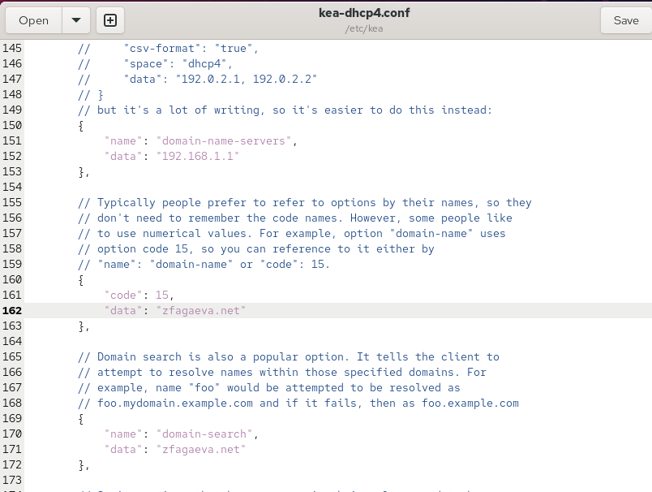{ #fig:001 width=70% height=70% }

## Настраиваю DHCP-подсеть

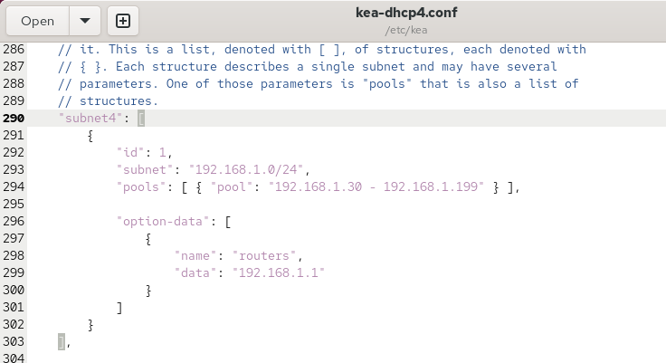{ #fig:002 width=70% height=70% }

## Привязываю DHCP к интерфейсу eth1

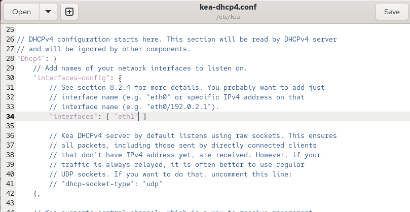{ #fig:003 width=70% height=70% }

## Проверяю конфигурацию DHCP-сервера

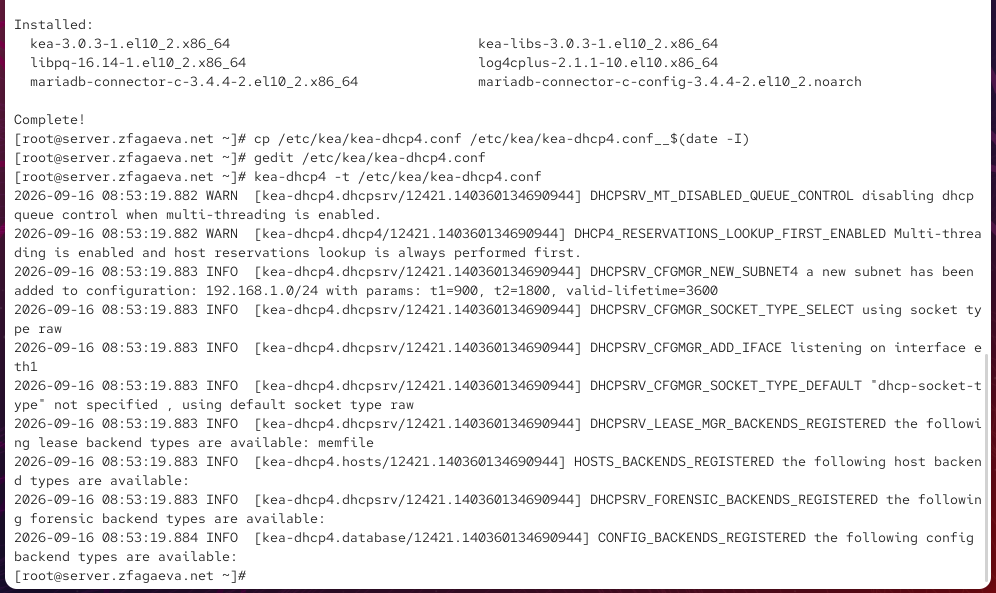{ #fig:004 width=70% height=70% }

## Добавляю DHCP-сервер в прямую DNS-зону

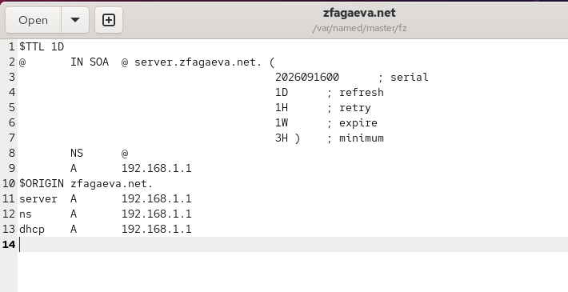{ #fig:005 width=70% height=70% }

## Добавляю DHCP-сервер в обратную DNS-зону

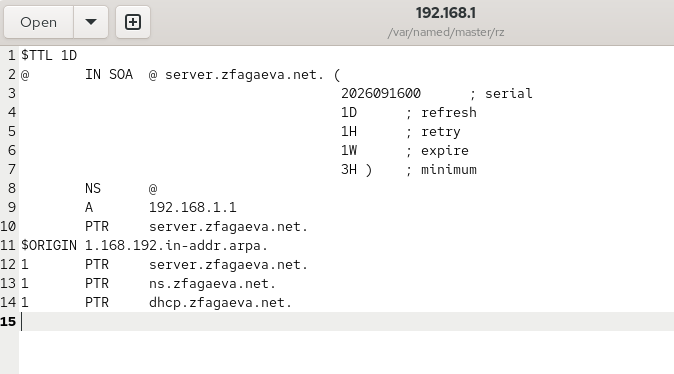{ #fig:006 width=70% height=70% }

## Проверяю доступность DHCP-сервера

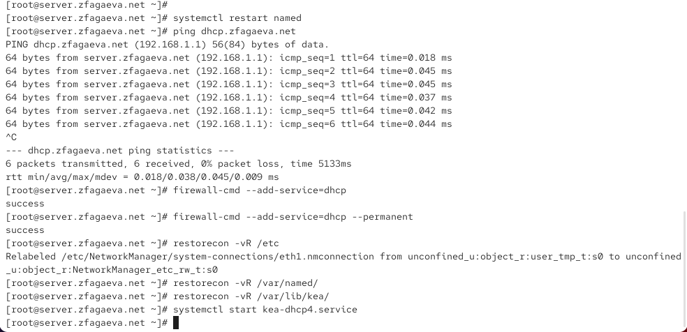{ #fig:007 width=70% height=70% }

## Настраиваю маршрутизацию клиента

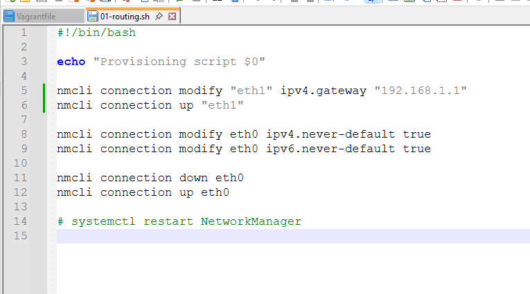{ #fig:008 width=70% height=70% }

## Проверяю сетевые интерфейсы клиента

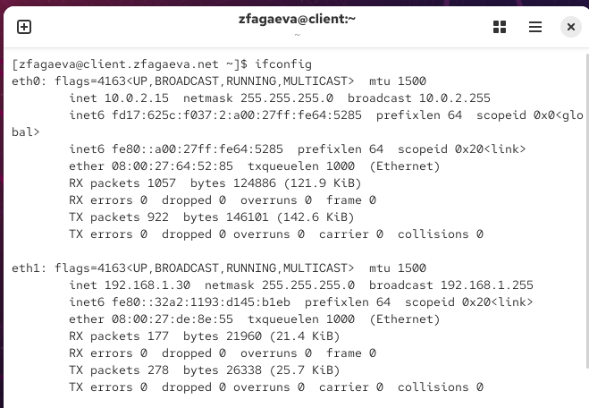{ #fig:009 width=70% height=70% }

## Анализирую выданную DHCP-аренду

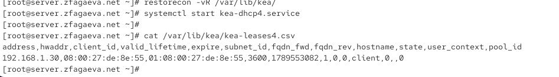{ #fig:010 width=70% height=70% }

## Создаю TSIG-ключ

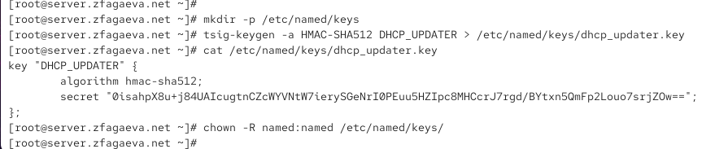{ #fig:011 width=70% height=70% }

## Разрешаю динамическое обновление DNS-зон

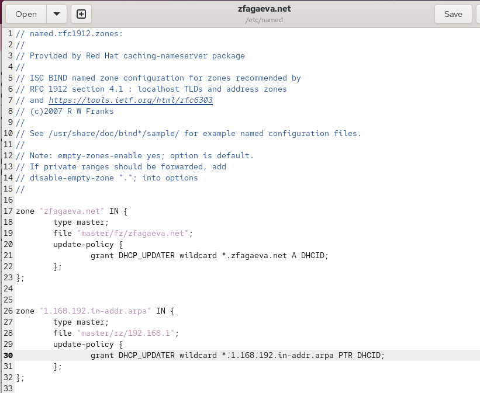{ #fig:012 width=70% height=70% }

## Настраиваю ключ для Kea

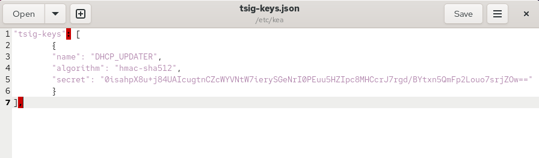{ #fig:013 width=70% height=70% }

## Настраиваю DHCP-DDNS

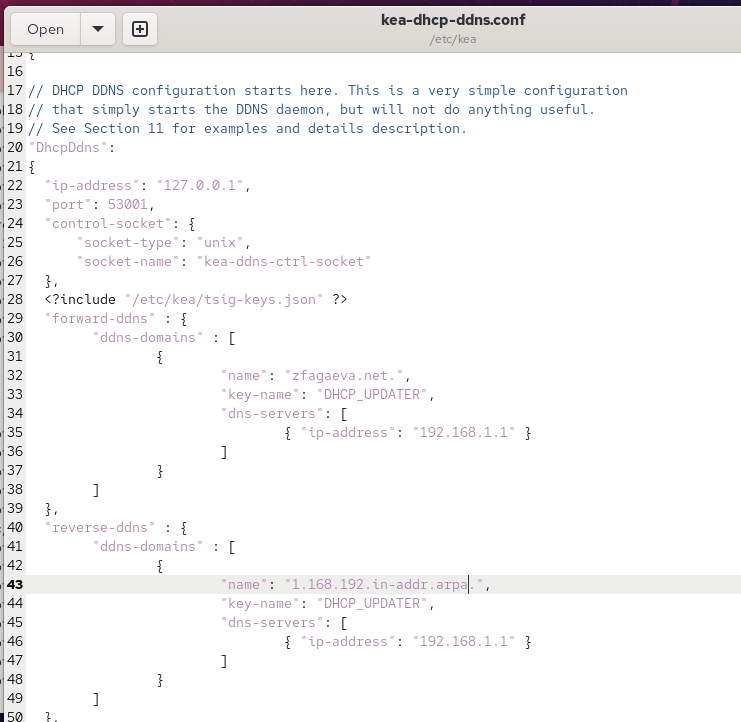{ #fig:014 width=70% height=70% }

## Запускаю службу Kea DHCP-DDNS

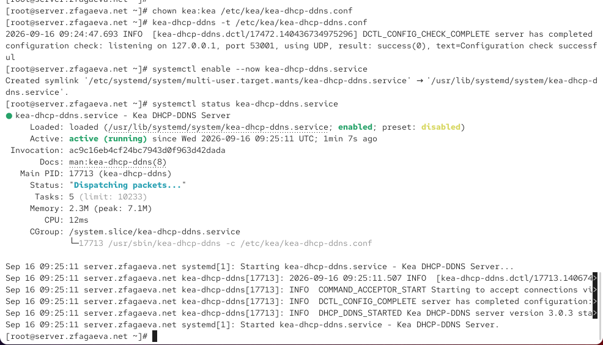{ #fig:015 width=70% height=70% }

## Включаю DDNS в DHCPv4

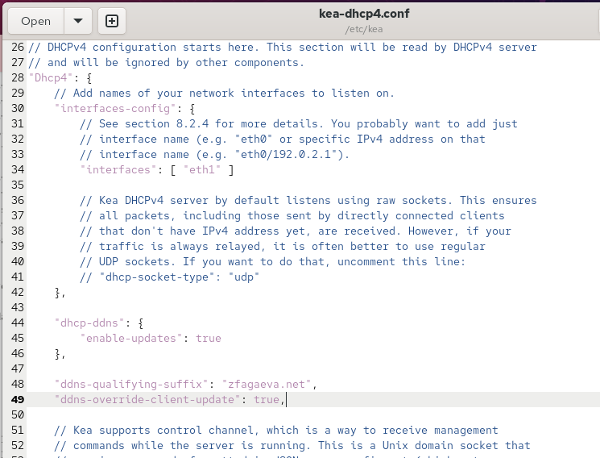{ #fig:016 width=70% height=70% }

## Проверяю работу DHCPv4

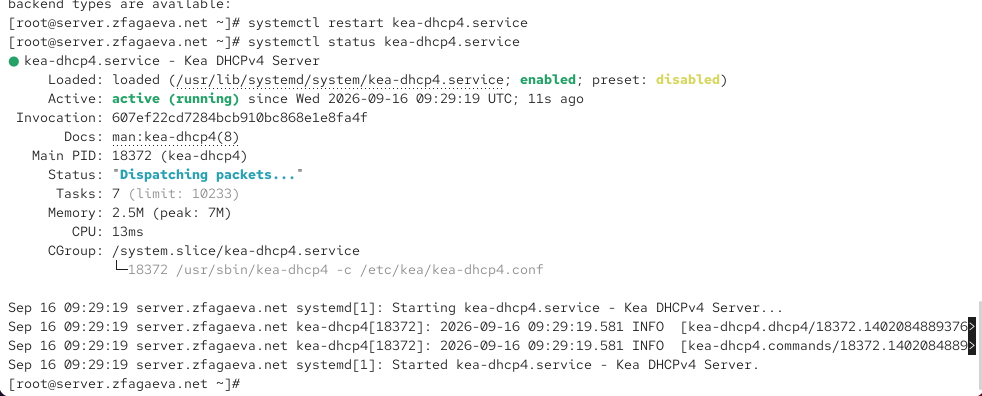{ #fig:017 width=70% height=70% }

## Проверяю DNS-запись клиента

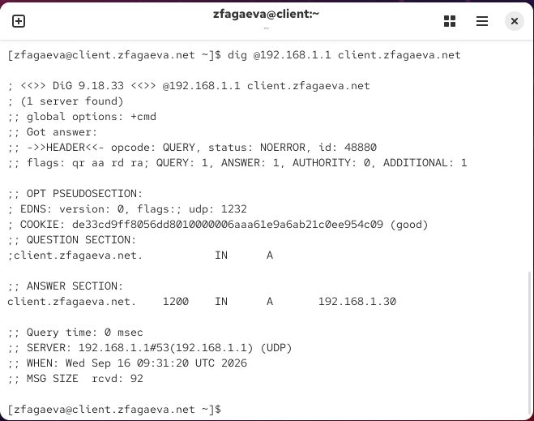{ #fig:018 width=70% height=70% }

## Создаю скрипт dhcp.sh

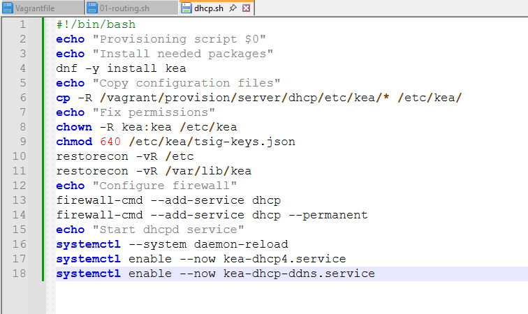{ #fig:019 width=70% height=70% }

# Выводы по проделанной работе

## Вывод

В ходе лабораторной работы был установлен и настроен DHCP-сервер Kea на виртуальной машине `server`.

Для внутренней сети `192.168.1.0/24` был задан диапазон адресов `192.168.1.30–192.168.1.199`.

Клиентская машина `client` получила адрес `192.168.1.30` через DHCP.

Было настроено динамическое обновление DNS-зоны с помощью DDNS и TSIG-ключа `DHCP_UPDATER`.

Работоспособность DHCP и DDNS была проверена с помощью `ifconfig`, `ping`, `dig` и анализа файла `kea-leases4.csv`.

Также был создан скрипт `dhcp.sh`, автоматизирующий установку и настройку DHCP-сервера.