---
## Author
author:
  name: Агаева Зейнаб Фуад кызы
  email: 1032245473@rudn.ru
  affiliation:
    - name: Российский университет дружбы народов
      country: Российская Федерация
      postal-code: 117198
      city: Москва
      address: ул. Миклухо-Маклая, д. 6

## Title
title: "Отчёт по лабораторной работе №4"
subtitle: "Базовая настройка HTTP-сервера Apache"
license: "CC BY"
---

# Цель работы

Приобретение практических навыков по установке и базовому конфигурированию HTTP-сервера Apache.

# Выполнение лабораторной работы

На виртуальной машине `server` перехожу в режим суперпользователя и устанавливаю стандартный набор программного обеспечения для организации HTTP-сервера командой `dnf -y groupinstall "Basic Web Server"`. В результате устанавливаются веб-сервер Apache HTTP Server и необходимые дополнительные компоненты: `httpd`, `httpd-core`, `httpd-filesystem`, `httpd-tools`, `apr`, `apr-util`, `mod_fcgid`, `mod_http2`, `mod_lua`, `mod_ssl` и другие зависимости (см. рис. [@fig-001]).

После завершения установки просматриваю содержимое каталогов конфигурации Apache. В каталоге `/etc/httpd/conf` находятся основной файл конфигурации `httpd.conf` и файл `magic`, используемый для определения типов содержимого. Каталог `/etc/httpd/conf.d` предназначен для дополнительных конфигурационных файлов и содержит `autoindex.conf`, `fcgid.conf`, `manual.conf`, `ssl.conf`, `userdir.conf`, `welcome.conf` и другие файлы. Основные параметры сервера задаются в `httpd.conf`, а отдельные функциональные возможности подключаются посредством файлов из `/etc/httpd/conf.d`.

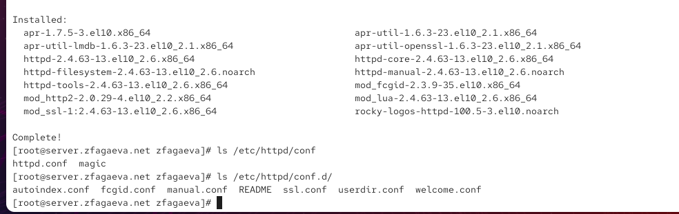{ #fig-001 width=70% }

Для разрешения входящих HTTP-соединений изменяю настройки межсетевого экрана. Добавляю сервис `http` сначала в текущую конфигурацию командой `firewall-cmd --add-service=http`, а затем в постоянную конфигурацию командой `firewall-cmd --add-service=http --permanent`. Обе команды завершаются сообщением `success` (см. рис. [@fig-002]).

После настройки межсетевого экрана включаю автоматический запуск Apache командой `systemctl enable httpd` и запускаю HTTP-сервер командой `systemctl start httpd`. Проверяю состояние службы с помощью `systemctl status httpd`. Служба `httpd.service` находится в состоянии `active (running)`, а параметр `Loaded` показывает, что её автоматический запуск включён. В системном журнале присутствует сообщение `Server configured, listening on: port 443, port 80`, подтверждающее успешную загрузку конфигурации и прослушивание HTTP- и HTTPS-портов. Сообщение `Started httpd.service - The Apache HTTP Server` также подтверждает успешный запуск веб-сервера.

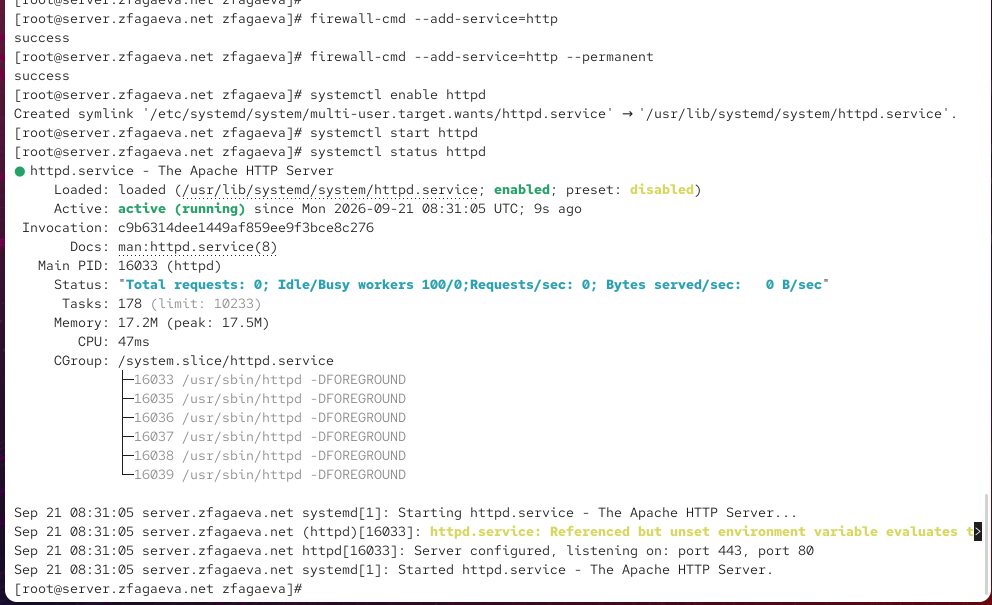{ #fig-002 width=70% }

На виртуальной машине `client` открываю браузер и обращаюсь к HTTP-серверу по адресу `http://192.168.1.1` (см. рис. [@fig-003]). В браузере отображается стандартная страница `HTTP Server Test Page`, используемая Rocky Linux для проверки работоспособности Apache. Её появление подтверждает, что виртуальная машина `client` имеет сетевой доступ к серверу `192.168.1.1`, межсетевой экран пропускает HTTP-трафик, а служба `httpd` принимает и обрабатывает запросы.

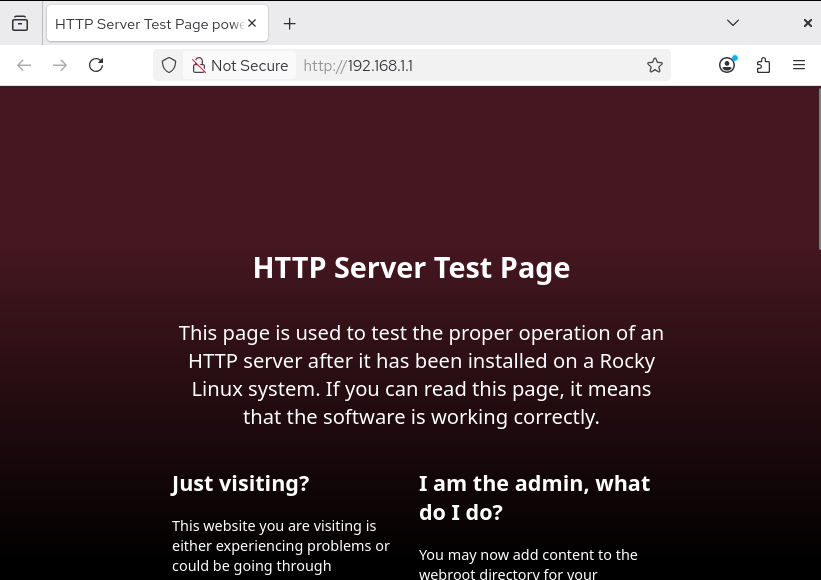{ #fig-003 width=70% }

Для анализа работы HTTP-сервера на виртуальной машине `server` просматриваю журнал ошибок `/var/log/httpd/error_log` командой `tail -f /var/log/httpd/error_log` (см. рис. [@fig-004]). В нём отображается информация об инициализации Apache, работе механизма `suexec`, включённой политике SELinux и успешном переходе сервера к штатной работе. Запись `resuming normal operations` свидетельствует о нормальном запуске веб-сервера.

Затем командой `tail -f /var/log/httpd/access_log` отслеживаю обращения клиентов. В журнале фиксируются HTTP-запросы от узла `192.168.1.30`, являющегося клиентской виртуальной машиной. Для запроса `GET / HTTP/1.1` зарегистрирован код `403`, после чего браузер загружает ресурсы стандартной тестовой страницы, например `/icons/poweredby.png`, для которых сервер возвращает код `200`. Для `/favicon.ico` регистрируется код `404`, поскольку соответствующий файл отсутствует. Эти записи подтверждают поступление запросов с виртуальной машины `client` и их обработку Apache.

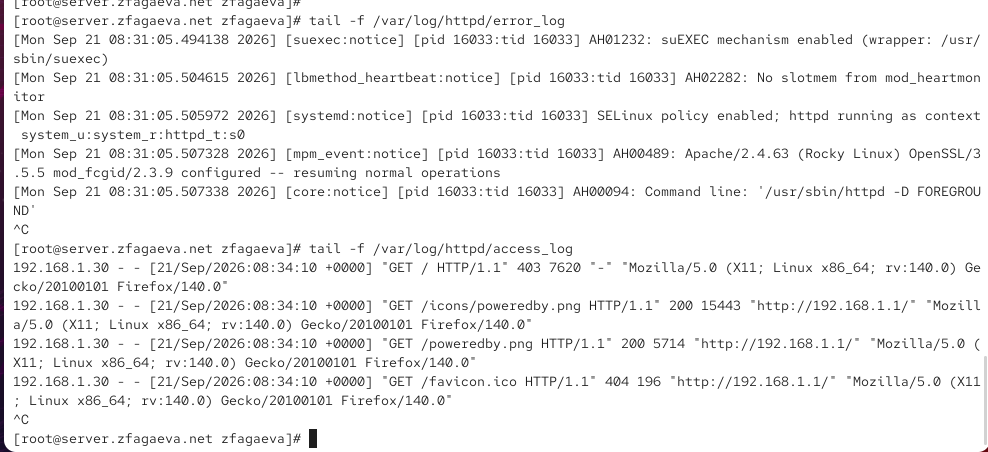{ #fig-004 width=70% }

Для организации виртуального хостинга по именам `server.zfagaeva.net` и `www.zfagaeva.net` изменяю настройки DNS. Перед редактированием файлов зон останавливаю службу `named`, после чего открываю файл прямой зоны `/var/named/master/fz/zfagaeva.net` (см. рис. [@fig-005]). Серийный номер зоны устанавливаю равным `2026092100`. В зоне уже присутствуют записи для узлов `dhcp`, `ns` и `server`, связанные с IPv4-адресом `192.168.1.1`. Добавляю запись `www A 192.168.1.1`, благодаря которой доменное имя `www.zfagaeva.net` разрешается в адрес HTTP-сервера `192.168.1.1`.

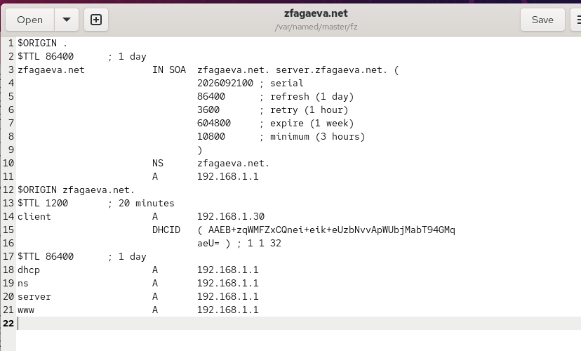{ #fig-005 width=70% }

Аналогично редактирую файл обратной зоны `/var/named/master/rz/192.168.1` (см. рис. [@fig-006]). В нём устанавливаю серийный номер `2026092100` и добавляю для IPv4-адреса `192.168.1.1` PTR-запись `www.zfagaeva.net.`. В зоне также присутствуют обратные записи для `server.zfagaeva.net.`, `ns.zfagaeva.net.` и `dhcp.zfagaeva.net.`. После внесения изменений удаляю файлы журналов DNS-зон при их наличии и повторно запускаю службу `named`.

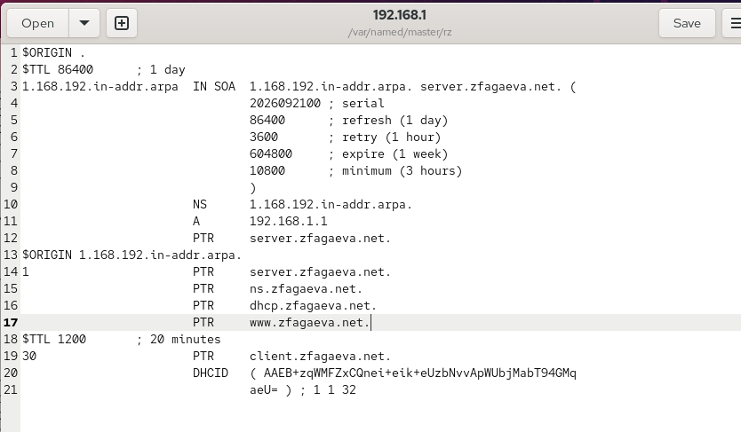{ #fig-006 width=70% }

Для настройки первого виртуального HTTP-сервера в каталоге `/etc/httpd/conf.d` создаю файл `server.zfagaeva.net.conf` (см. рис. [@fig-007]). В директиве `<VirtualHost *:80>` указываю, что виртуальный хост должен обслуживать соединения на TCP-порту `80`. Параметр `ServerAdmin` получает значение `webmaster@zfagaeva.net`, а в `DocumentRoot` задаю каталог `/var/www/html/server.zfagaeva.net`, содержащий веб-контент данного узла. Директива `ServerName server.zfagaeva.net` определяет DNS-имя виртуального сервера. Для раздельного журналирования ошибок и обращений задаю файлы `logs/server.zfagaeva.net-error_log` и `logs/server.zfagaeva.net-access_log`.

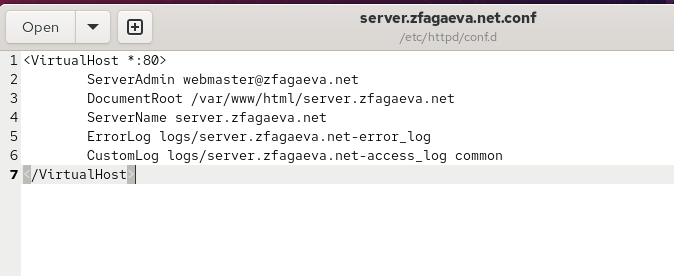{ #fig-007 width=70% }

Второй виртуальный хост настраиваю в файле `/etc/httpd/conf.d/www.zfagaeva.net.conf` (см. рис. [@fig-008]). Для него также используется порт `80`, однако значение `ServerName` устанавливаю равным `www.zfagaeva.net`, а корневым каталогом веб-сайта назначаю `/var/www/html/www.zfagaeva.net`. Журналы этого виртуального хоста записываются отдельно в файлы `logs/www.zfagaeva.net-error_log` и `logs/www.zfagaeva.net-access_log`. Благодаря параметрам `ServerName` Apache может выбирать необходимую конфигурацию виртуального хоста в зависимости от имени, указанного клиентом в HTTP-запросе.

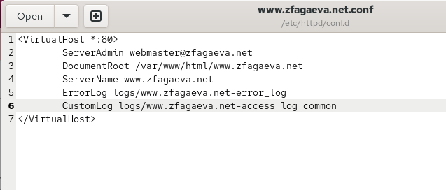{ #fig-008 width=70% }

Для виртуального хоста `server.zfagaeva.net` создаю каталог `/var/www/html/server.zfagaeva.net` и файл `index.html`. В файл помещаю тестовую строку `Welcome to the server.zfagaeva.net server.` (см. рис. [@fig-009]). Этот файл является главной страницей первого виртуального веб-сервера.

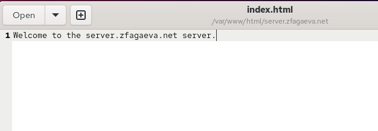{ #fig-009 width=70% }

Для второго виртуального сервера создаю каталог `/var/www/html/www.zfagaeva.net` и размещаю в нём файл `index.html` с текстом `Welcome to the www.zfagaeva.net server.` (см. рис. [@fig-010]). Раздельные каталоги `DocumentRoot` позволяют двум виртуальным хостам, работающим на одном IPv4-адресе и одном TCP-порту, возвращать различное содержимое.

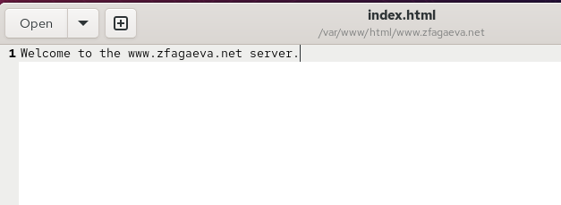{ #fig-010 width=70% }

После создания веб-контента изменяю владельца файлов и каталогов командой `chown -R apache:apache /var/www/`, назначая пользователю и группе `apache` права владения содержимым веб-сервера (см. рис. [@fig-011]). Затем восстанавливаю корректные контексты безопасности SELinux командами `restorecon -vR /etc`, `restorecon -vR /var/named/` и `restorecon -vR /var/www/`. В выводе `restorecon` видно восстановление контекстов для отдельных системных файлов. После выполнения настроек перезапускаю HTTP-сервер командой `systemctl restart httpd`. Команда завершается без сообщения об ошибке, что свидетельствует об успешной загрузке изменённой конфигурации.

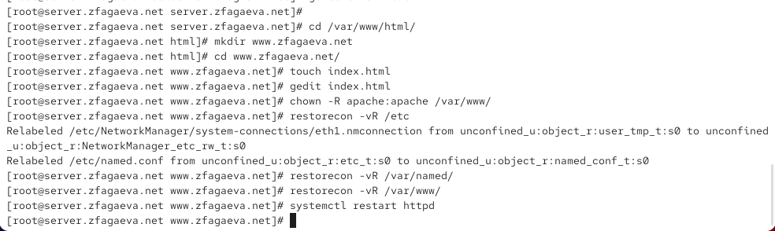{ #fig-011 width=70% }

На виртуальной машине `client` проверяю первый виртуальный хост, открывая в браузере адрес `http://server.zfagaeva.net` (см. рис. [@fig-012]). Вместо стандартной тестовой страницы Apache отображается содержимое созданного файла `index.html` — `Welcome to the server.zfagaeva.net server.`. Это подтверждает корректную работу прямого DNS-разрешения и конфигурации виртуального хоста `server.zfagaeva.net`.

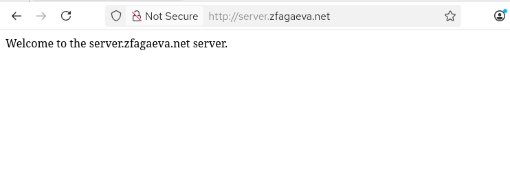{ #fig-012 width=70% }

Затем открываю в браузере адрес `http://www.zfagaeva.net` (см. рис. [@fig-013]). Сервер возвращает страницу с текстом `Welcome to the www.zfagaeva.net server.`. Получение различного содержимого по адресам `server.zfagaeva.net` и `www.zfagaeva.net` при использовании одного IPv4-адреса `192.168.1.1` подтверждает корректную работу виртуального хостинга Apache на основе доменных имён.

{ #fig-013 width=70% }

Для сохранения выполненной настройки во внутреннем окружении Vagrant перехожу в каталог `/vagrant/provision/server` и создаю структуру каталогов для HTTP-сервера. Конфигурационные файлы из `/etc/httpd/conf.d` сохраняю в `/vagrant/provision/server/http/etc/httpd/conf.d`, а содержимое каталогов виртуальных хостов из `/var/www/html` — в `/vagrant/provision/server/http/var/www/html`. Также обновляю сохранённую конфигурацию DNS-сервера в каталоге `/vagrant/provision/server/dns`, копируя в неё актуальные файлы из `/var/named`.

После этого в каталоге `/vagrant/provision/server` создаю исполняемый скрипт `http.sh`, автоматизирующий установку и настройку HTTP-сервера (см. рис. [@fig-014]). Скрипт устанавливает группу пакетов `Basic Web Server`, копирует сохранённые конфигурационные файлы Apache и содержимое веб-сайтов в `/etc/httpd` и `/var/www`, назначает каталогам владельца `apache:apache`, восстанавливает контексты SELinux, разрешает сервис `http` в текущей и постоянной конфигурациях `firewalld`, включает автоматический запуск `httpd` и запускает HTTP-сервер.

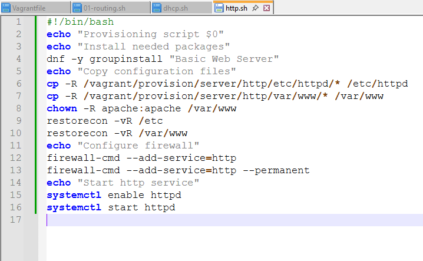{ #fig-014 width=70% }

# Вывод

В ходе лабораторной работы был установлен и настроен HTTP-сервер Apache на виртуальной машине `server`. Для обеспечения доступа к веб-серверу был разрешён сервис `http` в настройках межсетевого экрана, после чего служба `httpd` была добавлена в автозагрузку и запущена. Работоспособность сервера была проверена с виртуальной машины `client` обращением к адресу `192.168.1.1`.

Для анализа работы Apache были изучены журналы `/var/log/httpd/error_log` и `/var/log/httpd/access_log`, позволяющие отслеживать ошибки веб-сервера и HTTP-запросы клиентов.

Был настроен виртуальный хостинг для доменных имён `server.zfagaeva.net` и `www.zfagaeva.net`. Для каждого виртуального хоста создан отдельный каталог с веб-контентом и собственный конфигурационный файл. Также были дополнены прямая и обратная DNS-зоны. Корректность настройки проверена на машине `client`: при обращении к каждому доменному имени отображалась соответствующая тестовая страница.

Для автоматизации установки и настройки HTTP-сервера был создан скрипт `http.sh`, выполняющий установку необходимых пакетов, копирование конфигурационных файлов и веб-контента, настройку владельца файлов и контекстов SELinux, изменение настроек межсетевого экрана и запуск службы `httpd`. Для автоматического выполнения скрипта при развёртывании виртуальной машины соответствующий provisioner был добавлен в `Vagrantfile`.

# Контрольные вопросы

1. Через какой порт по умолчанию работает Apache?

Для обычных HTTP-соединений Apache по умолчанию использует TCP-порт `80`.

Для защищённых HTTPS-соединений обычно используется TCP-порт `443`.

2. Под каким пользователем запускается Apache и к какой группе относится этот пользователь?

В Rocky Linux рабочие процессы Apache запускаются от имени пользователя `apache`, который относится к группе `apache`.

Эти параметры задаются в конфигурации HTTP-сервера директивами:

`User apache`

`Group apache`

Главный процесс Apache запускается с правами `root`, поскольку ему необходимо открыть привилегированные порты, например порт `80`, после чего обработка запросов выполняется рабочими процессами с ограниченными правами пользователя `apache`.

3. Где располагаются лог-файлы веб-сервера? Что можно по ним отслеживать?

Основные журналы Apache находятся в каталоге:

`/var/log/httpd/`

Основными файлами являются:

`/var/log/httpd/access_log` — журнал обращений к веб-серверу;

`/var/log/httpd/error_log` — журнал ошибок и диагностических сообщений.

По `access_log` можно отслеживать IP-адрес клиента, время обращения, запрошенный ресурс, используемый HTTP-метод, код ответа сервера и объём переданных данных.

По `error_log` можно отслеживать ошибки запуска и работы Apache, проблемы с конфигурацией, доступом к файлам, виртуальными хостами, модулями и обработкой запросов.

Для виртуальных хостов могут использоваться отдельные журналы. Например, в выполненной работе для `server.zfagaeva.net` были заданы:

`logs/server.zfagaeva.net-error_log`

`logs/server.zfagaeva.net-access_log`

а для `www.zfagaeva.net`:

`logs/www.zfagaeva.net-error_log`

`logs/www.zfagaeva.net-access_log`

4. Где по умолчанию содержится контент веб-серверов?

По умолчанию основной веб-контент Apache в Rocky Linux размещается в каталоге:

`/var/www/html/`

Этот каталог задаётся директивой `DocumentRoot`. Для виртуальных хостов можно использовать отдельные каталоги. В выполненной работе использовались:

`/var/www/html/server.zfagaeva.net`

и

`/var/www/html/www.zfagaeva.net`

В каждом из этих каталогов находится собственный файл `index.html`.

5. Каким образом реализуется виртуальный хостинг? Что он даёт?

Виртуальный хостинг в Apache реализуется с помощью блоков `<VirtualHost>`, в которых для каждого веб-сайта задаются его доменное имя, каталог с контентом, журналы и другие параметры.

Например:

`<VirtualHost *:80>`

означает, что виртуальный хост принимает HTTP-запросы на порту `80`, а директива:

`ServerName server.zfagaeva.net`

определяет доменное имя, для которого применяется соответствующая конфигурация.

Apache анализирует имя хоста, передаваемое клиентом в HTTP-заголовке `Host`, и на его основании выбирает нужный виртуальный хост.

Виртуальный хостинг позволяет размещать несколько независимых веб-сайтов на одном сервере, используя один IP-адрес и один TCP-порт. При этом каждый сайт может иметь собственное доменное имя, отдельный каталог `DocumentRoot`, свои журналы и индивидуальные параметры конфигурации.
