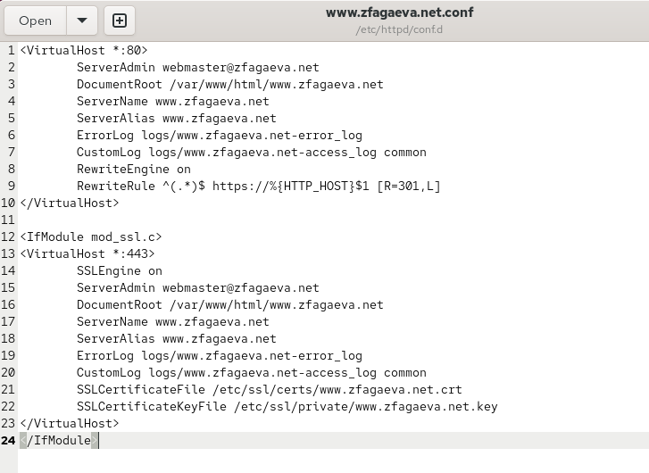
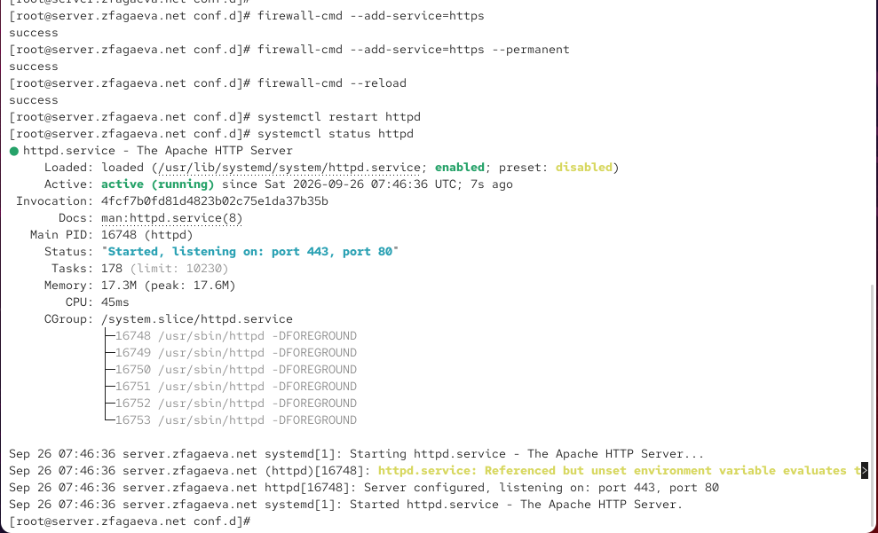
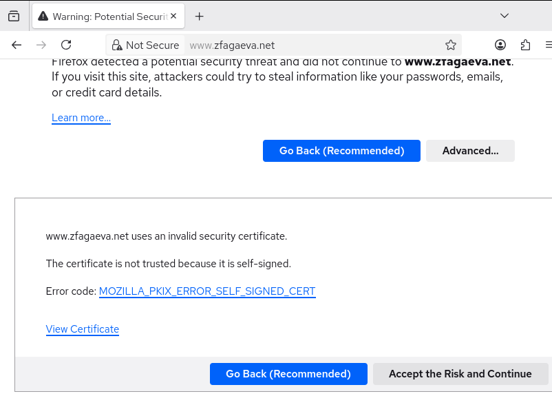
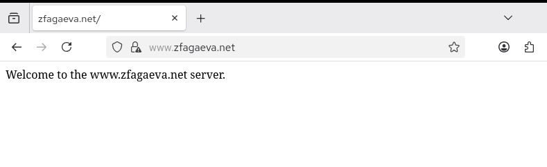
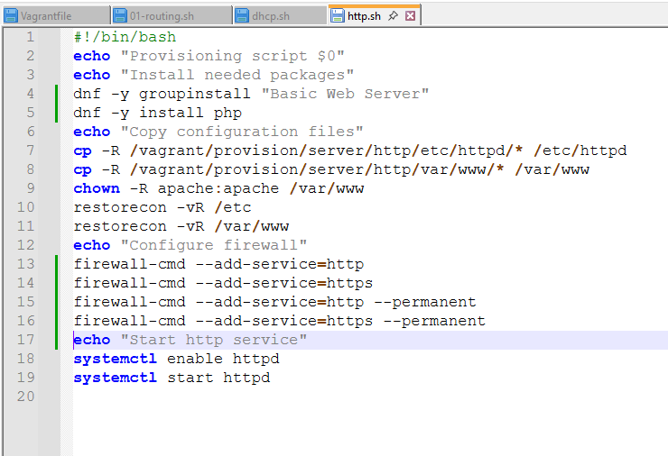

---
## Author
author:
  name: Агаева Зейнаб Фуад кызы
  email: 1032245473@rudn.ru
  affiliation:
    - name: Российский университет дружбы народов
      country: Российская Федерация
      postal-code: 117198
      city: Москва
      address: ул. Миклухо-Маклая, д. 6

## Title
title: Лабораторная работа №5
subtitle: Расширенная настройка HTTP-сервера Apache
license: CC BY
date: today
date-format: "YYYY-MM-DD"
---

# Цели и задачи работы

## Цель лабораторной работы

Получить практические навыки расширенной настройки HTTP-сервера Apache: организации работы через HTTPS, подключения PHP и автоматизации настройки веб-сервера во внутреннем окружении виртуальной машины `server`.

# Процесс выполнения лабораторной работы

## Генерирую ключ и самоподписанный сертификат

{ #fig:001 width=70% height=70% }

## Настраиваю виртуальный хост для HTTPS

{ #fig:002 width=70% height=70% }

## Разрешаю HTTPS в межсетевом экране

{ #fig:003 width=70% height=70% }

## Проверяю подключение к сайту по HTTPS

{ #fig:004 width=70% height=70% }

## Открываю веб-сервер после добавления исключения

{ #fig:005 width=70% height=70% }

## Просматриваю сведения о сертификате

{ #fig:006 width=70% height=70% }

## Создаю PHP-страницу для проверки работы PHP

{ #fig:007 width=70% height=70% }

## Устанавливаю PHP и настраиваю права доступа

{ #fig:008 width=70% height=70% }

## Проверяю работу PHP через браузер

{ #fig:009 width=70% height=70% }

## Корректирую provisioning-скрипт http.sh

{ #fig:010 width=70% height=70% }

# Выводы по проделанной работе

## Вывод

В ходе лабораторной работы была выполнена расширенная настройка HTTP-сервера Apache на виртуальной машине `server`.

Для веб-сервера `www.zfagaeva.net` был сгенерирован закрытый RSA-ключ и создан самоподписанный сертификат X.509.

Конфигурация виртуального хоста была изменена для работы через протокол HTTPS.

Для HTTP-запросов был настроен автоматический переход на защищённое соединение HTTPS.

В настройках межсетевого экрана был разрешён сервис `https`.

Работоспособность защищённого подключения была проверена с виртуальной машины `client`.

Для веб-сервера была установлена поддержка PHP.

Статическая страница была заменена файлом `index.php` с вызовом функции `phpinfo()`.

После настройки прав доступа и восстановления контекстов SELinux была проверена корректная обработка PHP-страницы.

Также был скорректирован скрипт `http.sh`, автоматизирующий установку Apache, установку PHP, копирование конфигурационных файлов, настройку прав доступа, восстановление контекстов SELinux, настройку межсетевого экрана и запуск службы `httpd`.