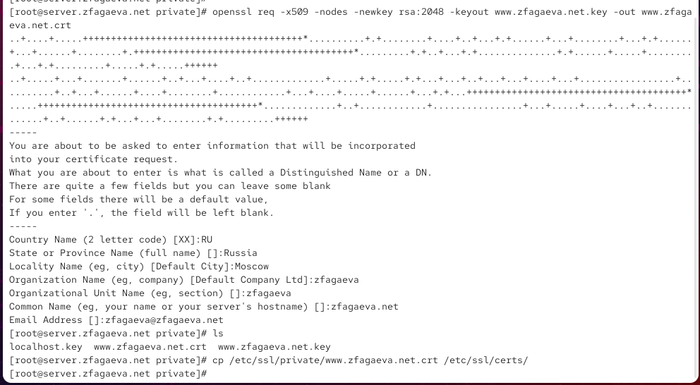
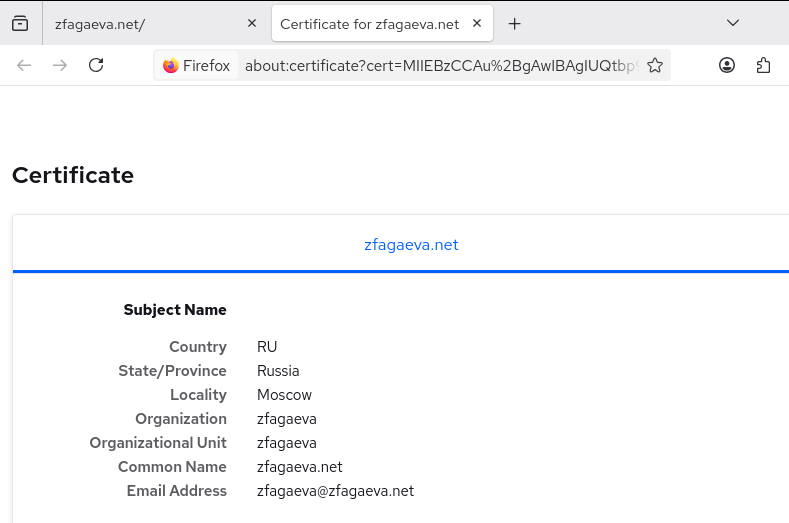
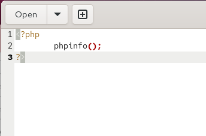
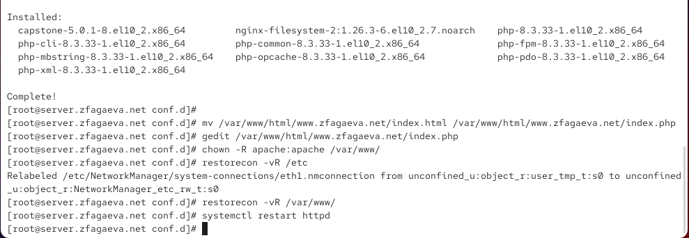
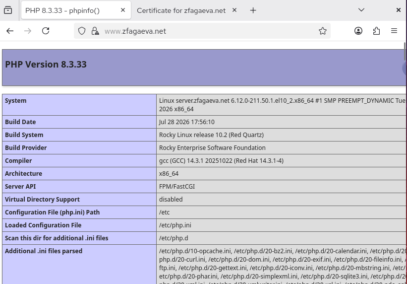

---
## Author
author:
  name: Агаева Зейнаб Фуад кызы
  email: 1032245473@rudn.ru
  affiliation:
    - name: Российский университет дружбы народов
      country: Российская Федерация
      postal-code: 117198
      city: Москва
      address: ул. Миклухо-Маклая, д. 6

## Title
title: "Отчёт по лабораторной работе №5"
subtitle: "Расширенная настройка HTTP-сервера Apache"
license: "CC BY"
---

# Цель работы

Приобретение практических навыков по расширенному конфигурированию HTTPсервера Apache в части безопасности и возможности использования PHP.

# Выполнение лабораторной работы

На виртуальной машине `server` перехожу в режим суперпользователя и выполняю подготовку каталогов для хранения закрытого ключа и сертификата веб-сервера. В каталоге `/etc/pki/tls` создаю каталог `private`, а для совместимости с используемыми в конфигурации Apache путями создаю символическую ссылку `/etc/ssl/private` на `/etc/pki/tls/private`. После этого перехожу в каталог с закрытыми ключами и генерирую новый закрытый RSA-ключ длиной 2048 бит и самоподписанный сертификат командой `openssl req -x509 -nodes -newkey rsa:2048 -keyout www.zfagaeva.net.key -out www.zfagaeva.net.crt` (см. рис. [@fig-001]).

Параметр `req` запускает обработку запроса на создание сертификата, а параметр `-x509` указывает OpenSSL непосредственно создать самоподписанный сертификат формата X.509. Параметр `-nodes` отключает шифрование закрытого ключа парольной фразой, что позволяет службе Apache использовать ключ автоматически при запуске без ручного ввода пароля. Параметр `-newkey rsa:2048` задаёт одновременное создание нового закрытого RSA-ключа длиной 2048 бит. С помощью `-keyout www.zfagaeva.net.key` задаю имя файла закрытого ключа, а параметром `-out www.zfagaeva.net.crt` — имя создаваемого сертификата.

При заполнении данных сертификата в поле страны `Country Name` указываю `RU`, в поле региона `State or Province Name` — `Russia`, в поле города `Locality Name` — `Moscow`. В качестве организации и подразделения указываю `zfagaeva`. В поле `Common Name` задаю доменное имя `zfagaeva.net`, а в поле адреса электронной почты — `zfagaeva@zfagaeva.net`. После завершения генерации проверяю наличие файлов командой `ls`. В каталоге присутствуют сертификат `www.zfagaeva.net.crt` и закрытый ключ `www.zfagaeva.net.key`. Сертификат копирую в каталог `/etc/ssl/certs/`, откуда Apache будет использовать его при установлении HTTPS-соединения.

{ #fig-001 width=70% }

Для перевода виртуального веб-сервера `www.zfagaeva.net` на работу через HTTPS изменяю конфигурационный файл `/etc/httpd/conf.d/www.zfagaeva.net.conf` (см. рис. [@fig-002]). В файле создаю отдельные виртуальные хосты для портов `80` и `443`. Первый виртуальный хост принимает обычные HTTP-запросы и перенаправляет их на HTTPS, а второй непосредственно обслуживает защищённые TLS-соединения.

Строка `<VirtualHost *:80>` открывает секцию виртуального хоста, принимающего соединения на TCP-порту `80` со всех сетевых интерфейсов сервера. Директива `ServerAdmin webmaster@zfagaeva.net` задаёт адрес администратора веб-сервера. Директива `DocumentRoot /var/www/html/www.zfagaeva.net` определяет каталог, содержащий файлы сайта. Строка `ServerName www.zfagaeva.net` задаёт основное доменное имя виртуального хоста, а `ServerAlias www.zfagaeva.net` определяет дополнительное имя, по которому Apache может сопоставить входящий запрос с данным виртуальным сервером.

Директива `ErrorLog logs/www.zfagaeva.net-error_log` задаёт файл журнала ошибок виртуального хоста. Директива `CustomLog logs/www.zfagaeva.net-access_log common` задаёт файл журнала обращений и указывает использовать стандартный формат журналирования `common`. Строка `RewriteEngine on` включает механизм преобразования URL модуля `mod_rewrite`. Правило `RewriteRule ^(.*)$ https://%{HTTP_HOST}$1 [R=301,L]` перехватывает входящий HTTP-запрос и формирует для него адрес с протоколом `https`. Переменная `%{HTTP_HOST}` содержит имя узла из HTTP-запроса, а `$1` содержит путь, соответствующий выражению `^(.*)$`. Флаг `R=301` выполняет постоянное перенаправление с кодом HTTP `301`, а флаг `L` прекращает дальнейшую обработку правил после срабатывания данного правила. Строка `</VirtualHost>` завершает конфигурацию виртуального хоста на порту `80`.

Строка `<IfModule mod_ssl.c>` указывает Apache обрабатывать расположенный внутри блок только при загруженном модуле `mod_ssl`. Далее директива `<VirtualHost *:443>` открывает конфигурацию виртуального хоста, принимающего HTTPS-соединения на стандартном TCP-порту `443`. Строка `SSLEngine on` включает использование SSL/TLS для данного виртуального хоста.

Внутри HTTPS-виртуального хоста директива `ServerAdmin webmaster@zfagaeva.net` повторно задаёт адрес администратора, `DocumentRoot /var/www/html/www.zfagaeva.net` указывает каталог веб-содержимого, а `ServerName www.zfagaeva.net` и `ServerAlias www.zfagaeva.net` определяют доменное имя сервера. Строки `ErrorLog logs/www.zfagaeva.net-error_log` и `CustomLog logs/www.zfagaeva.net-access_log common` задают журналы ошибок и обращений.

Директива `SSLCertificateFile /etc/ssl/certs/www.zfagaeva.net.crt` задаёт путь к созданному сертификату X.509. Директива `SSLCertificateKeyFile /etc/ssl/private/www.zfagaeva.net.key` задаёт путь к соответствующему закрытому ключу. Строка `</VirtualHost>` завершает секцию HTTPS-виртуального хоста, а `</IfModule>` закрывает условный блок модуля `mod_ssl`.

{ #fig-002 width=70% }

После настройки виртуального хоста изменяю параметры межсетевого экрана, разрешая входящие HTTPS-соединения. Добавляю сервис `https` в текущую конфигурацию командой `firewall-cmd --add-service=https`, после чего выполняю `firewall-cmd --add-service=https --permanent`, чтобы сохранить разрешение после перезагрузки системы. Обе команды завершаются сообщением `success`. Затем применяю постоянную конфигурацию командой `firewall-cmd --reload`, которая также выполняется успешно (см. рис. [@fig-003]).

После изменения межсетевого экрана перезапускаю Apache командой `systemctl restart httpd` и проверяю его состояние командой `systemctl status httpd`. Служба `httpd.service` находится в состоянии `active (running)`, а параметр `Loaded` показывает, что автоматический запуск службы включён. В сообщениях Apache присутствует строка `Started, listening on: port 443, port 80`, подтверждающая успешную загрузку конфигурации и одновременное прослушивание портов `443` и `80`.

{ #fig-003 width=70% }

На виртуальной машине `client` открываю в браузере адрес `www.zfagaeva.net`. Настроенное правило перенаправления переводит запрос с HTTP на HTTPS, после чего Firefox выводит предупреждение о потенциальной угрозе безопасности (см. рис. [@fig-004]). Причиной предупреждения является использование самостоятельно подписанного сертификата, который не выдан доверенным центром сертификации. На странице указывается сообщение о недоверенном сертификате и код ошибки `MOZILLA_PKIX_ERROR_SELF_SIGNED_CERT`.

Для продолжения работы открываю дополнительные параметры предупреждения и выбираю продолжение перехода на сайт, принимая связанный с самоподписанным сертификатом риск.

{ #fig-004 width=70% }

После добавления исключения страница виртуального сервера `www.zfagaeva.net` успешно открывается по защищённому соединению (см. рис. [@fig-005]). В браузере отображается содержимое сайта с сообщением `Welcome to the www.zfagaeva.net server.`. Это подтверждает работоспособность виртуального хоста после перехода на HTTPS и успешное использование Apache сертификата и закрытого ключа.

{ #fig-005 width=70% }

В браузере просматриваю сведения об используемом сертификате (см. рис. [@fig-006]). В данных субъекта сертификата указаны страна `RU`, регион `Russia`, город `Moscow`, организация `zfagaeva` и подразделение `zfagaeva`. Поле `Common Name` содержит имя `zfagaeva.net`, а поле `Email Address` — адрес `zfagaeva@zfagaeva.net`. Выведенные значения соответствуют данным, указанным при создании сертификата средствами OpenSSL.

{ #fig-006 width=70% }

Для добавления поддержки PHP устанавливаю соответствующий пакет командой `dnf -y install php`. Вместе с PHP устанавливаются необходимые зависимости и компоненты, среди которых `php-cli`, `php-common`, `php-fpm`, `php-mbstring`, `php-opcache`, `php-pdo` и `php-xml`. В установленном наборе используется PHP версии `8.3.33`.

После установки PHP изменяю главную страницу виртуального сервера. Файл `/var/www/html/www.zfagaeva.net/index.html` переименовываю в `/var/www/html/www.zfagaeva.net/index.php`, после чего открываю его для редактирования. В файле оставляю PHP-скрипт, вызывающий встроенную функцию `phpinfo()` (см. рис. [@fig-007]):

```php
<?php
    phpinfo();
?>
```

Функция `phpinfo()` формирует диагностическую веб-страницу, содержащую сведения о версии PHP, параметрах интерпретатора, подключённых модулях, конфигурационных файлах и параметрах среды выполнения. Использование данного скрипта позволяет проверить, что PHP корректно обрабатывается веб-сервером, а исходный код PHP не передаётся клиенту как обычный текст.

{ #fig-007 width=70% }

Для корректного доступа Apache к веб-контенту изменяю владельца каталога `/var/www` и всех вложенных объектов командой `chown -R apache:apache /var/www`. Затем восстанавливаю стандартные контексты безопасности SELinux для системных конфигурационных файлов командой `restorecon -vR /etc` и для веб-контента командой `restorecon -vR /var/www` (см. рис. [@fig-008]). При выполнении `restorecon` система корректирует обнаруженные контексты файлов в соответствии с действующей политикой SELinux.

После изменения прав и контекстов безопасности перезапускаю веб-сервер командой `systemctl restart httpd`, чтобы Apache продолжил работу с установленной поддержкой PHP и обновлённым содержимым виртуального хоста.

{ #fig-008 width=70% }

На виртуальной машине `client` повторно открываю `www.zfagaeva.net`. Вместо прежней статической страницы браузер отображает результат выполнения функции `phpinfo()` (см. рис. [@fig-009]). В верхней части страницы указана версия `PHP 8.3.33`. В разделе системной информации отображаются сведения о сервере `server.zfagaeva.net`, операционной системе Rocky Linux, архитектуре `x86_64`, интерфейсе веб-сервера `FPM/FastCGI`, расположении основного конфигурационного файла `/etc/php.ini` и каталоге дополнительных конфигурационных файлов `/etc/php.d`.

Появление страницы `phpinfo()` подтверждает, что запрос к файлу `index.php` обрабатывается интерпретатором PHP и результат выполнения скрипта успешно передаётся через Apache клиентскому браузеру.

{ #fig-009 width=70% }

Для фиксации выполненной расширенной настройки веб-сервера подготавливаю provisioning-файлы Vagrant. Конфигурационные файлы Apache копирую из `/etc/httpd/conf.d` в каталог `/vagrant/provision/server/http/etc/httpd/conf.d`, а содержимое `/var/www/html` — в `/vagrant/provision/server/http/var/www/html`. Дополнительно создаю в каталоге provisioning структуру `/vagrant/provision/server/http/etc/pki/tls/private` и `/vagrant/provision/server/http/etc/pki/tls/certs`, предназначенную для хранения закрытого ключа и сертификата, после чего помещаю туда файлы `www.zfagaeva.net.key` и `www.zfagaeva.net.crt`.

После сохранения конфигурационных файлов корректирую скрипт `/vagrant/provision/server/http.sh` (см. рис. [@fig-010]). В начале скрипта директива `#!/bin/bash` задаёт использование командной оболочки Bash. Команды `echo` выводят сообщения о выполняемых этапах настройки.

Команда `dnf -y groupinstall "Basic Web Server"` устанавливает стандартный набор программного обеспечения веб-сервера, а добавленная команда `dnf -y install php` обеспечивает автоматическую установку PHP при создании или повторном развёртывании виртуальной машины.

Команда `cp -R /vagrant/provision/server/http/etc/httpd/* /etc/httpd` переносит сохранённые конфигурационные файлы Apache из общего каталога Vagrant в системный каталог `/etc/httpd`. Команда `cp -R /vagrant/provision/server/http/var/www/* /var/www` восстанавливает подготовленное веб-содержимое. После копирования команда `chown -R apache:apache /var/www` назначает пользователю и группе `apache` владельцем файлов веб-сервера.

Команды `restorecon -vR /etc` и `restorecon -vR /var/www` восстанавливают корректные контексты SELinux для конфигурационных файлов и веб-контента. В разделе настройки межсетевого экрана команда `firewall-cmd --add-service=http` разрешает HTTP в текущей конфигурации, а `firewall-cmd --add-service=https` добавляет разрешение для HTTPS. Следующие команды `firewall-cmd --add-service=http --permanent` и `firewall-cmd --add-service=https --permanent` сохраняют оба разрешения в постоянной конфигурации межсетевого экрана.

В заключительной части скрипта команда `systemctl enable httpd` включает автоматический запуск Apache при загрузке операционной системы, а `systemctl start httpd` запускает службу веб-сервера. Благодаря добавлению установки `php` и разрешению сервиса `https` скрипт фиксирует основные изменения, выполненные при расширенной настройке HTTP-сервера, и позволяет автоматически воспроизводить их при развёртывании виртуальной машины `server`.

{ #fig-010 width=70% }

# Вывод

В ходе лабораторной работы была выполнена расширенная настройка HTTP-сервера Apache на виртуальной машине `server`. Для организации защищённого доступа к веб-серверу был сгенерирован закрытый RSA-ключ длиной 2048 бит и создан самоподписанный сертификат X.509 для доменного имени `www.zfagaeva.net`.

Конфигурация виртуального хоста `www.zfagaeva.net` была изменена для поддержки протокола HTTPS. Для HTTP-соединений на TCP-порту `80` было настроено автоматическое перенаправление запросов на HTTPS, а для защищённых соединений был настроен виртуальный хост на TCP-порту `443` с использованием созданных сертификата и закрытого ключа. В настройках межсетевого экрана был разрешён сервис `https`, после чего служба `httpd` была перезапущена. Работоспособность защищённого соединения проверена с виртуальной машины `client`.

Также была настроена поддержка языка PHP. На сервере установлены PHP и необходимые зависимости, а вместо статической страницы `index.html` создан файл `index.php` с вызовом функции `phpinfo()`. Для веб-контента были скорректированы права доступа и восстановлены контексты безопасности SELinux. Корректность настройки PHP подтверждена отображением в браузере страницы с информацией о версии и конфигурации PHP.

Для автоматизации расширенной настройки веб-сервера были сохранены конфигурационные файлы Apache, веб-контент, закрытый ключ и сертификат в каталоге provisioning Vagrant. Скрипт `/vagrant/provision/server/http.sh` был дополнен установкой PHP и настройкой межсетевого экрана для разрешения соединений по протоколам HTTP и HTTPS. Это позволяет воспроизводить выполненную конфигурацию при автоматическом развёртывании виртуальной машины `server`.

# Контрольные вопросы

1. В чём отличие HTTP от HTTPS?

`HTTP` (HyperText Transfer Protocol) — протокол прикладного уровня, используемый для передачи веб-страниц и других данных между клиентом и веб-сервером. При использовании обычного HTTP передаваемые данные не шифруются, поэтому при возможности перехвата сетевого трафика их содержимое потенциально может быть прочитано или изменено третьей стороной.

`HTTPS` (HyperText Transfer Protocol Secure) представляет собой HTTP, работающий поверх защищённого соединения `TLS`. Перед передачей HTTP-данных клиент и сервер устанавливают защищённое соединение, после чего передаваемая между ними информация шифруется.

По умолчанию HTTP использует TCP-порт `80`, а HTTPS — TCP-порт `443`.

Основное отличие заключается в том, что HTTPS обеспечивает шифрование передаваемых данных, проверку их целостности и возможность проверки подлинности веб-сервера с помощью цифрового сертификата.

2. Каким образом обеспечивается безопасность контента веб-сервера при работе через HTTPS?

Безопасность обмена данными при использовании HTTPS обеспечивается протоколом `TLS` и применением криптографических механизмов.

При подключении клиента к HTTPS-серверу веб-сервер предоставляет свой цифровой сертификат. Сертификат содержит сведения о сервере и его открытый ключ. Клиент проверяет сертификат, после чего в процессе TLS-рукопожатия клиент и сервер согласовывают криптографические параметры и формируют сеансовые ключи.

После установления соединения передаваемые HTTP-запросы и ответы шифруются с использованием сеансовых ключей. Благодаря этому перехватившая сетевой трафик третья сторона не может непосредственно прочитать передаваемое содержимое.

HTTPS обеспечивает три основных свойства безопасности:

- **конфиденциальность** — данные между клиентом и сервером передаются в зашифрованном виде;
- **целостность** — TLS позволяет обнаружить изменение передаваемой информации во время её передачи;
- **аутентификацию сервера** — цифровой сертификат позволяет клиенту проверить, что соединение установлено с сервером, которому принадлежит предъявленный сертификат.

В лабораторной работе использовался самоподписанный сертификат. Он позволяет создать зашифрованное HTTPS-соединение, однако браузер не может автоматически подтвердить доверие к его издателю, поэтому при первом подключении отображается предупреждение о недоверенном сертификате.

3. Что такое сертификационный центр? Приведите пример.

Сертификационный центр, или `CA` (Certificate Authority), — организация или служба, занимающаяся выпуском и подтверждением цифровых сертификатов. Сертификационный центр проверяет сведения о владельце сертификата в соответствии со своей процедурой проверки и подписывает сертификат собственной цифровой подписью.

Браузеры и операционные системы содержат хранилища доверенных корневых сертификатов сертификационных центров. Если сертификат веб-сервера связан с доверенным сертификационным центром корректной цепочкой сертификатов и остальные проверки успешно пройдены, браузер может установить доверенное HTTPS-соединение без предупреждения о неизвестном издателе.

Примером сертификационного центра является `Let's Encrypt`. Он предоставляет бесплатные TLS-сертификаты и поддерживает автоматизированный процесс их получения и обновления. Сертификаты Let's Encrypt широко используются для организации защищённого доступа к веб-сайтам по протоколу HTTPS.