---
## Author
author:
  name: Агаева Зейнаб Фуад кызы
  email: 1032245473@rudn.ru
  affiliation:
    - name: Российский университет дружбы народов
      country: Российская Федерация
      postal-code: 117198
      city: Москва
      address: ул. Миклухо-Маклая, д. 6

## Title
title: Лабораторная работа №2
subtitle: Настройка DNS-сервера
license: CC BY
date: today
date-format: "YYYY-MM-DD"
---

# Цели и задачи работы

## Цель лабораторной работы

Получить практические навыки установки, настройки и диагностики DNS-сервера BIND на виртуальной машине `server`.

# Процесс выполнения лабораторной работы

## Устанавливаю BIND и проверяю DNS-запрос

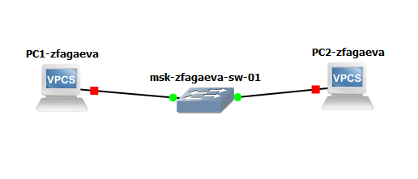{ #fig:001 width=70% height=70% }

## Анализирую resolv.conf и named.conf

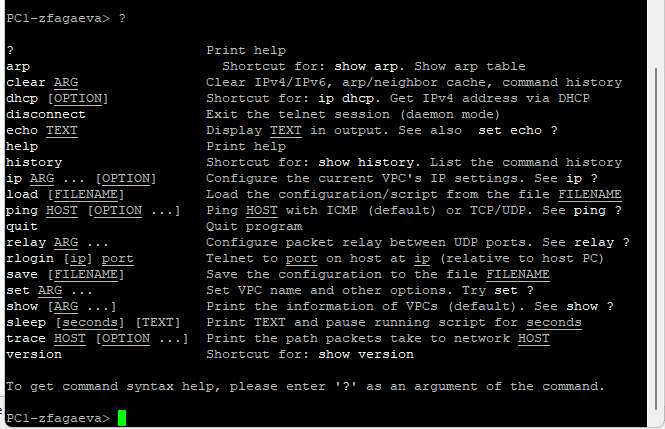{ #fig:002 width=70% height=70% }

## Анализирую файл named.ca

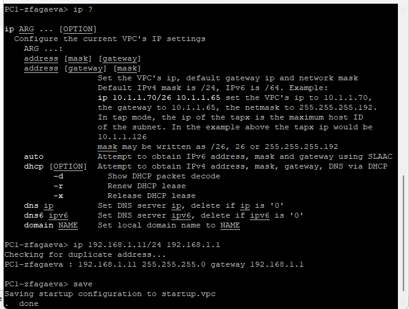{ #fig:003 width=70% height=70% }

## Анализирую стандартные локальные зоны

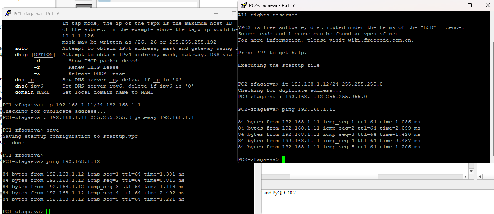{ #fig:004 width=70% height=70% }

## Запускаю службу named

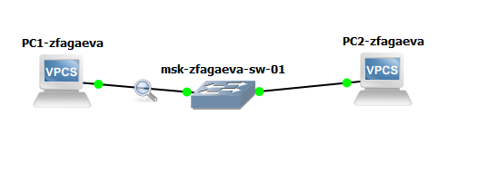{ #fig:005 width=70% height=70% }

## Назначаю локальный DNS-сервер

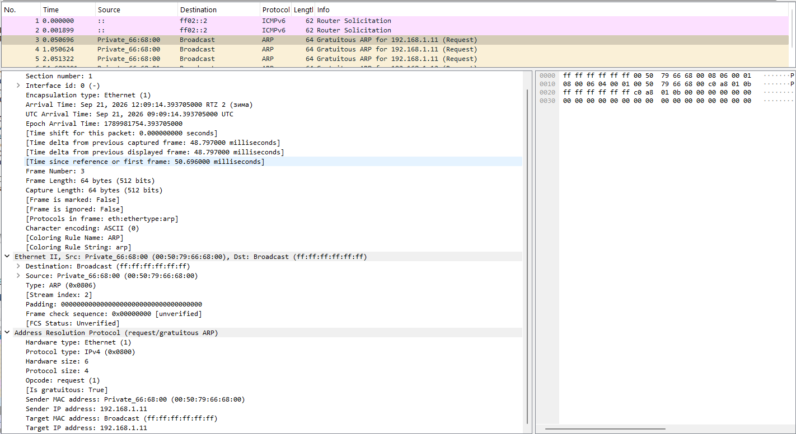{ #fig:006 width=70% height=70% }

## Настраиваю named.conf для внутренней сети

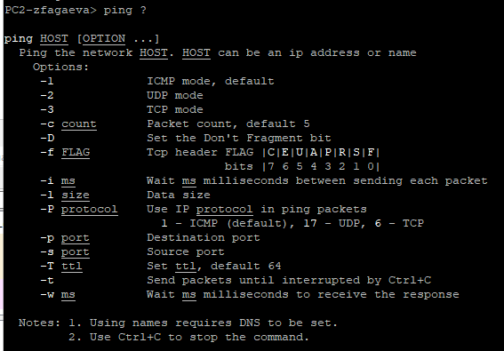{ #fig:007 width=70% height=70% }

## Настраиваю межсетевой экран

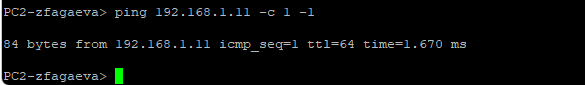{ #fig:008 width=70% height=70% }

## Подключаю файл описания DNS-зон

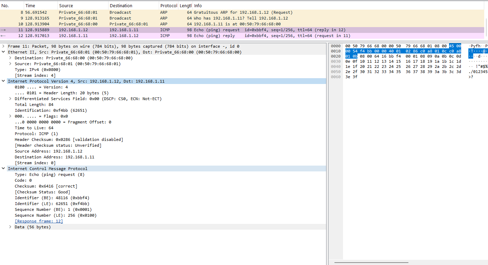{ #fig:009 width=70% height=70% }

## Описываю прямую и обратную зоны

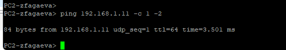{ #fig:010 width=70% height=70% }

## Настраиваю прямую DNS-зону

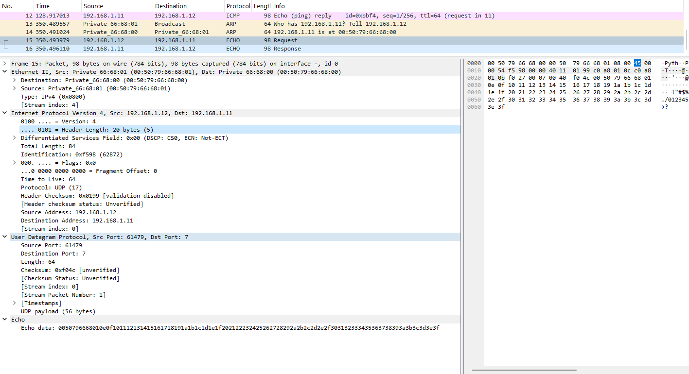{ #fig:011 width=70% height=70% }

## Настраиваю обратную DNS-зону

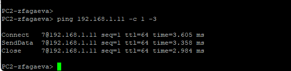{ #fig:012 width=70% height=70% }

## Настраиваю права доступа и SELinux

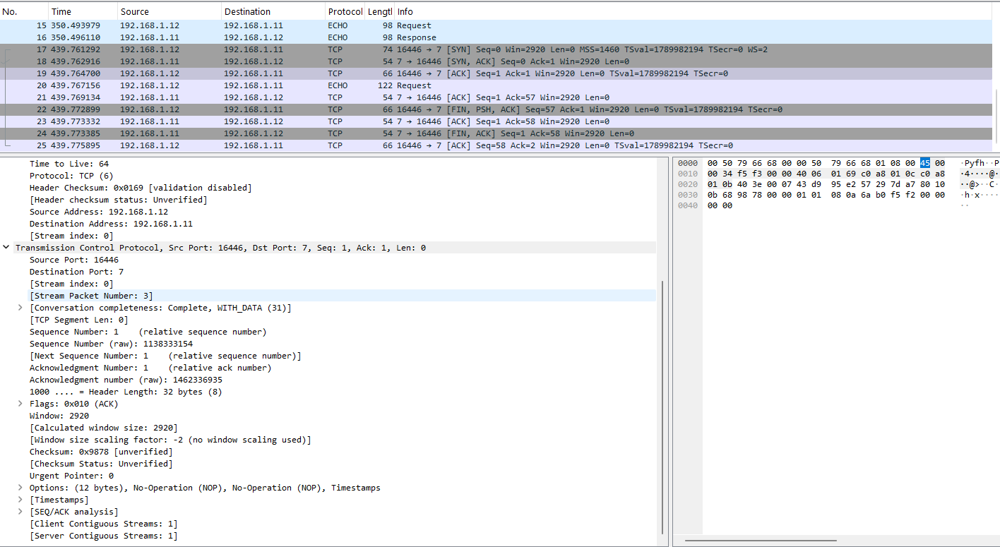{ #fig:013 width=70% height=70% }

## Проверяю DNS-запись через dig

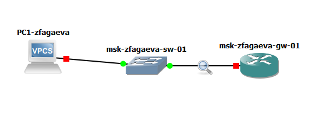{ #fig:014 width=70% height=70% }

## Проверяю работу DNS-сервера через host

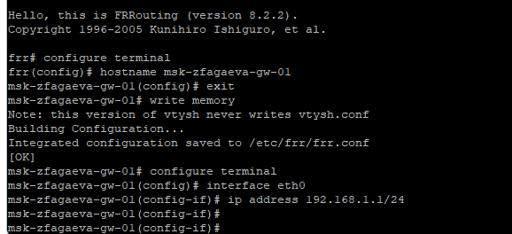{ #fig:015 width=70% height=70% }

## Создаю скрипт dns.sh

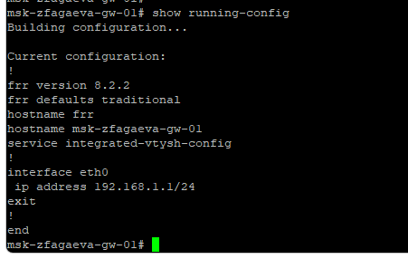{ #fig:016 width=70% height=70% }

# Выводы по проделанной работе

## Вывод

В ходе лабораторной работы был установлен и настроен DNS-сервер BIND на виртуальной машине `server`.

Была выполнена настройка кэширующего DNS-сервера, а локальный адрес `127.0.0.1` был назначен DNS-сервером по умолчанию.

Для домена `zfagaeva.net` были созданы прямая и обратная DNS-зоны.

Работоспособность DNS-сервера была проверена с помощью утилит `dig` и `host`.

Также был подготовлен скрипт `dns.sh`, автоматизирующий установку и настройку DNS-сервера во внутреннем окружении виртуальной машины.