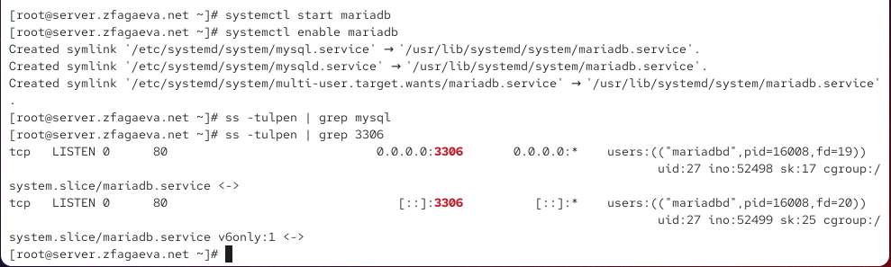
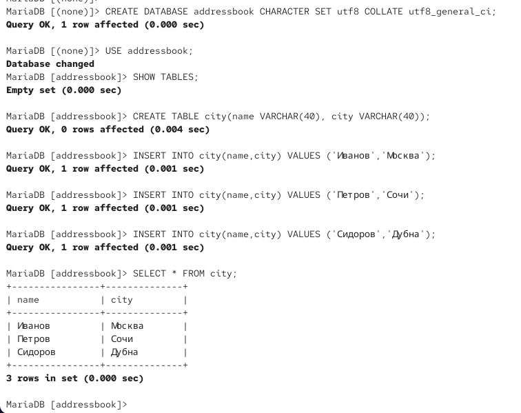
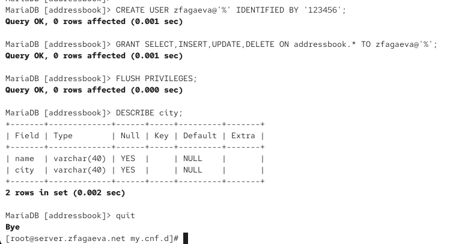

---
## Author
author:
  name: Агаева Зейнаб Фуад кызы
  email: 1032245473@rudn.ru
  affiliation:
    - name: Российский университет дружбы народов
      country: Российская Федерация
      postal-code: 117198
      city: Москва
      address: ул. Миклухо-Маклая, д. 6

## Title
title: Лабораторная работа №6
subtitle: Установка и настройка системы управления базами данных MariaDB
license: CC BY
date: today
date-format: "YYYY-MM-DD"
---

# Цели и задачи работы

## Цель лабораторной работы

Получить практические навыки установки, настройки и администрирования системы управления базами данных MariaDB, настройки кодировки UTF-8, создания базы данных и пользователей, резервного копирования и восстановления данных, а также автоматизации настройки MariaDB во внутреннем окружении виртуальной машины `server`.

# Процесс выполнения лабораторной работы

## Устанавливаю MariaDB и просматриваю конфигурацию

{ #fig:001 width=70% height=70% }

## Запускаю MariaDB и проверяю порт 3306

{ #fig:002 width=70% height=70% }

## Выполняю первоначальную настройку безопасности MariaDB

{ #fig:003 width=70% height=70% }

## Просматриваю команды оболочки MariaDB

{ #fig:004 width=70% height=70% }

## Просматриваю доступные системные базы данных

{ #fig:005 width=70% height=70% }

## Проверяю параметры MariaDB до настройки UTF-8

{ #fig:006 width=70% height=70% }

## Настраиваю использование кодировки UTF-8

{ #fig:007 width=70% height=70% }

## Проверяю применение кодировки UTF-8

{ #fig:008 width=70% height=70% }

## Создаю базу данных addressbook и таблицу city

{ #fig:009 width=70% height=70% }

## Создаю пользователя и назначаю ему права доступа

{ #fig:010 width=70% height=70% }

## Проверяю базу данных и таблицу с помощью mysqlshow

{ #fig:011 width=70% height=70% }

## Создаю и восстанавливаю резервные копии базы данных

{ #fig:012 width=70% height=70% }

## Создаю provisioning-скрипт для MariaDB

{ #fig:013 width=70% height=70% }

# Выводы по проделанной работе

## Вывод

В ходе лабораторной работы была установлена и настроена система управления базами данных MariaDB на виртуальной машине `server`.

Была выполнена первоначальная настройка безопасности MariaDB и настроено использование кодировки UTF-8 по умолчанию.

Создана база данных `addressbook` и таблица `city`, содержащая сведения о сотрудниках и городах их работы.

Также был создан отдельный пользователь MariaDB и настроены его права доступа к базе данных.

С помощью `mysqldump` были созданы резервные копии базы `addressbook` и выполнено восстановление данных.