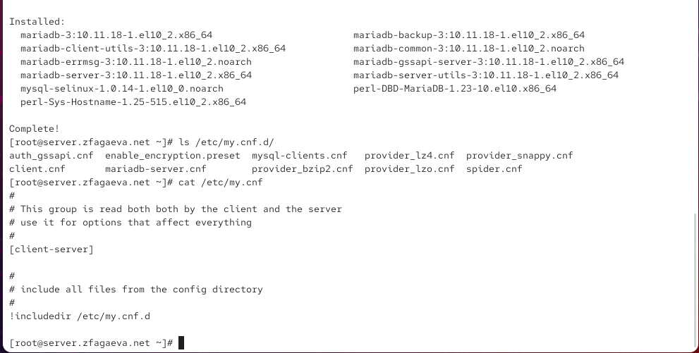
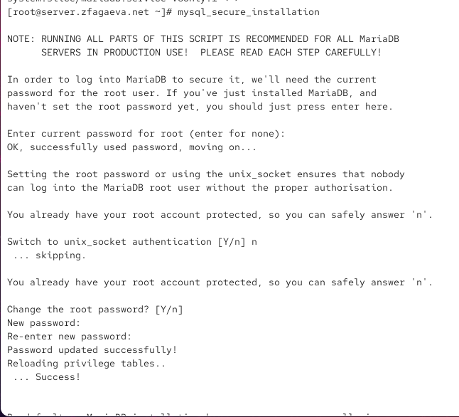
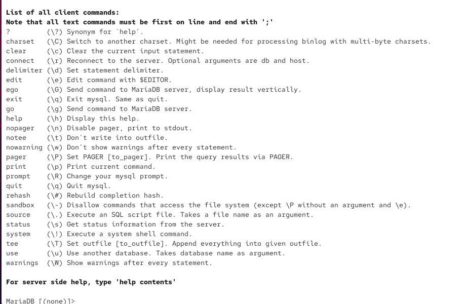
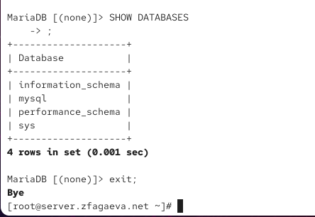
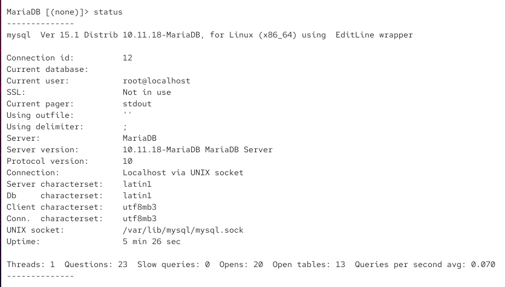
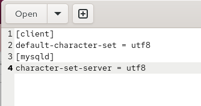
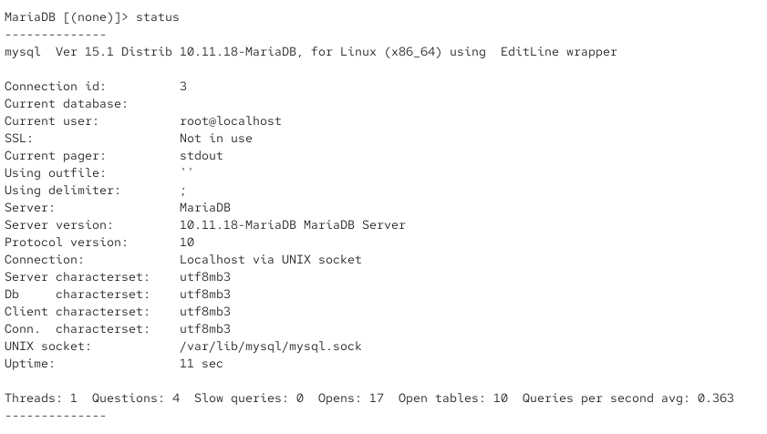
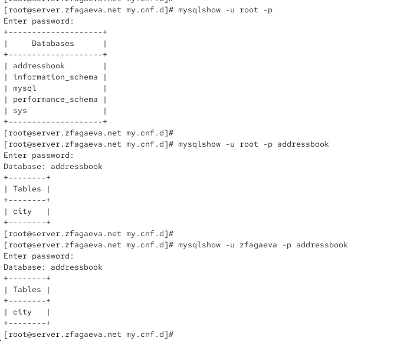
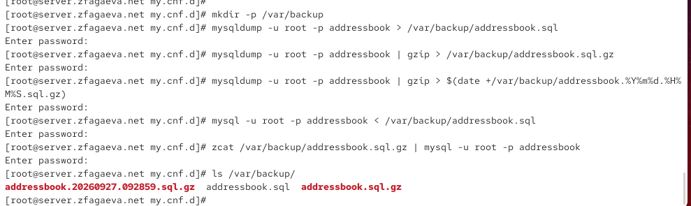
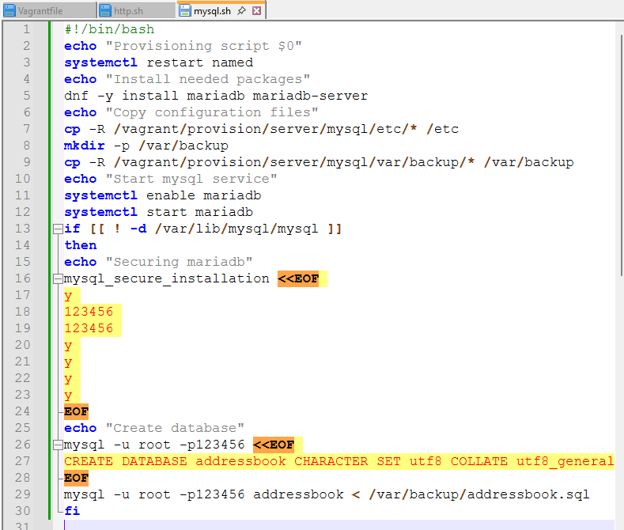

---
## Author
author:
  name: Агаева Зейнаб Фуад кызы
  email: 1032245473@rudn.ru
  affiliation:
    - name: Российский университет дружбы народов
      country: Российская Федерация
      postal-code: 117198
      city: Москва
      address: ул. Миклухо-Маклая, д. 6

## Title
title: "Отчёт по лабораторной работе №6"
subtitle: "Установка и настройка системы управления базами данных MariaDB"
license: "CC BY"
---

# Цель работы

Приобретение практических навыков по установке и конфигурированию системы управления базами данных на примере программного обеспечения MariaDB.

# Выполнение лабораторной работы

На виртуальной машине `server` перехожу в режим суперпользователя и устанавливаю пакеты, необходимые для работы с СУБД MariaDB, командой `dnf -y install mariadb mariadb-server`. Параметр `-y` автоматически подтверждает установку пакетов и необходимых зависимостей. В результате устанавливаются основные компоненты `mariadb` и `mariadb-server`, клиентские утилиты `mariadb-client-utils`, серверные утилиты `mariadb-server-utils`, общие файлы `mariadb-common`, средства резервного копирования `mariadb-backup`, пакет сообщений `mariadb-errmsg`, серверный модуль GSSAPI `mariadb-gssapi-server`, драйвер `perl-DBD-MariaDB` и дополнительные зависимости. Завершение установки подтверждается сообщением `Complete!` (см. рис. [@fig-001]).

После установки просматриваю содержимое каталога `/etc/my.cnf.d/` командой `ls /etc/my.cnf.d/`. В нём находятся конфигурационные файлы `auth_gssapi.cnf`, `client.cnf`, `enable_encryption.preset`, `mariadb-server.cnf`, `mysql-clients.cnf`, `provider_bzip2.cnf`, `provider_lz4.cnf`, `provider_lzo.cnf`, `provider_snappy.cnf` и `spider.cnf`. Файл `client.cnf` предназначен для параметров клиентских программ MariaDB, `mariadb-server.cnf` содержит параметры серверного процесса, `mysql-clients.cnf` относится к настройкам клиентских утилит. Файл `auth_gssapi.cnf` связан с использованием механизма аутентификации GSSAPI. Файлы `provider_bzip2.cnf`, `provider_lz4.cnf`, `provider_lzo.cnf` и `provider_snappy.cnf` относятся к подключаемым провайдерам соответствующих алгоритмов сжатия, а `spider.cnf` — к настройкам механизма хранения Spider. Файл `enable_encryption.preset` содержит подготовленные параметры, связанные с включением шифрования.

Командой `cat /etc/my.cnf` просматриваю основной конфигурационный файл MariaDB. Строки, начинающиеся с символа `#`, являются комментариями и не обрабатываются сервером. Комментарий `This group is read both by the client and the server` указывает, что последующая группа параметров предназначена одновременно для клиентской и серверной частей. Строка `[client-server]` объявляет общую группу параметров, которая может использоваться и клиентскими программами, и сервером. Следующий комментарий `include all files from the config directory` поясняет назначение последней директивы. Директива `!includedir /etc/my.cnf.d` предписывает MariaDB дополнительно загрузить конфигурационные файлы из каталога `/etc/my.cnf.d`. Благодаря этому дополнительные настройки можно размещать в отдельных файлах, не изменяя основной `/etc/my.cnf`.

{ #fig-001 width=70% }

После установки запускаю службу MariaDB командой `systemctl start mariadb`. Затем выполняю `systemctl enable mariadb`, чтобы включить автоматический запуск службы при загрузке операционной системы. В результате создаются символические ссылки для `mysql.service`, `mysqld.service` и `mariadb.service`, связанные с системной службой MariaDB (см. рис. [@fig-002]).

Для проверки прослушиваемого MariaDB сетевого порта выполняю `ss -tulpen | grep mysql`. Поскольку в выводе по имени процесса результат отсутствует, дополнительно выполняю `ss -tulpen | grep 3306`. В результате отображается процесс `mariadbd`, прослушивающий TCP-порт `3306`. Адрес `0.0.0.0:3306` соответствует прослушиванию порта по IPv4, а `[::]:3306` — по IPv6. В выводе также указаны идентификатор процесса `pid=16008`, файловые дескрипторы и принадлежность сокетов службе `mariadb.service`. Наличие состояния `LISTEN` подтверждает успешный запуск сервера баз данных.

{ #fig-002 width=70% }

После запуска MariaDB выполняю первоначальную настройку безопасности с помощью команды `mysql_secure_installation` (см. рис. [@fig-003]). Данный сценарий предназначен для изменения параметров, которые нежелательно оставлять в конфигурации сервера после установки.

В начале сценарий запрашивает текущий пароль административного пользователя `root` MariaDB. После успешной аутентификации предлагается перейти на механизм `unix_socket`. В данном случае отвечаю `n`, поэтому режим аутентификации через UNIX-сокет не включается. Далее на запрос `Change the root password? [Y/n]` подтверждаю смену пароля, дважды ввожу новый пароль. Сообщения `Password updated successfully!`, `Reloading privilege tables...` и `Success!` подтверждают успешную смену пароля и обновление таблиц привилегий.

На последующих этапах мастера безопасности удаляю анонимных пользователей, запрещаю удалённый вход для административной учётной записи `root`, удаляю тестовую базу данных и обновляю таблицы привилегий. В результате административный доступ к MariaDB защищается отдельным паролем, а настройки, предназначенные преимущественно для первоначального тестирования сервера, удаляются.

{ #fig-003 width=70% }

После настройки безопасности вхожу в интерактивную оболочку MariaDB с правами администратора командой `mysql -u root -p`. Параметр `-u root` задаёт имя пользователя базы данных, а `-p` указывает клиентской программе запросить пароль перед подключением.

В интерактивной оболочке выполняю команду `\h`, предназначенную для отображения справки по клиентским командам MariaDB (см. рис. [@fig-004]). В выводе присутствуют, в частности, команды `connect` для повторного подключения к серверу, `delimiter` для изменения разделителя SQL-запросов, `exit` и `quit` для завершения работы клиента, `help` для вызова справки, `source` для выполнения команд из SQL-файла, `status` для просмотра информации о соединении и сервере, `use` для выбора рабочей базы данных и `system` для выполнения команды оболочки операционной системы. Для большей части клиентских команд также приведены их сокращённые варианты, например `\q` для выхода и `\s` для вывода статуса.

{ #fig-004 width=70% }

Для просмотра имеющихся после установки баз данных выполняю SQL-запрос `SHOW DATABASES;` (см. рис. [@fig-005]). В результате отображаются четыре системные базы данных: `information_schema`, `mysql`, `performance_schema` и `sys`.

База `information_schema` предоставляет информацию о структуре баз данных, таблицах, столбцах и других объектах сервера. База `mysql` содержит системные таблицы MariaDB, включая данные, необходимые для управления пользователями и привилегиями. База `performance_schema` используется для сбора диагностической информации и показателей работы сервера. База `sys` предоставляет представления, упрощающие анализ сведений из `performance_schema`. После просмотра списка баз данных выхожу из интерактивной оболочки командой `exit;`, после чего появляется сообщение `Bye`.

{ #fig-005 width=70% }

Перед изменением кодировки снова подключаюсь к MariaDB и выполняю команду `status`, чтобы определить текущие параметры клиента, соединения и сервера (см. рис. [@fig-006]).

Первая строка `mysql Ver 15.1 Distrib 10.11.18-MariaDB, for Linux (x86_64) using EditLine wrapper` указывает версию клиентской программы, используемую версию MariaDB `10.11.18`, архитектуру `x86_64` и применение библиотеки EditLine для интерактивной работы. Поле `Connection id: 12` содержит идентификатор текущего соединения с сервером. Значение `Current database:` отсутствует, поскольку рабочая база данных в этот момент не выбрана. Поле `Current user: root@localhost` показывает, что соединение установлено от имени пользователя `root` с локальной машины.

Строка `SSL: Not in use` указывает, что для текущего локального подключения SSL/TLS не используется. Значение `Current pager: stdout` означает вывод результата непосредственно в стандартный поток вывода. Пустое значение `Using outfile: ''` показывает, что результаты запросов не перенаправляются в отдельный файл. Поле `Using delimiter: ;` определяет символ `;` как стандартный разделитель SQL-команд.

Поле `Server: MariaDB` указывает используемую СУБД, а `Server version: 10.11.18-MariaDB MariaDB Server` содержит точную версию серверной части. Значение `Protocol version: 10` соответствует версии протокола взаимодействия клиентской программы с сервером. Строка `Connection: Localhost via UNIX socket` показывает, что локальное подключение выполнено через UNIX-сокет, а не через TCP/IP.

До изменения параметров поле `Server characterset` имеет значение `latin1`, и `Db characterset` также содержит `latin1`. При этом `Client characterset` и `Conn. characterset` имеют значение `utf8mb3`. Строка `UNIX socket: /var/lib/mysql/mysql.sock` указывает путь к файлу локального сокета MariaDB. Поле `Uptime: 5 min 26 sec` показывает продолжительность работы сервера на момент выполнения команды.

В последней строке статистики значение `Threads: 1` соответствует числу активных потоков, `Questions: 23` — количеству обработанных сервером запросов, `Slow queries: 0` показывает отсутствие медленных запросов, `Opens: 20` — количество операций открытия таблиц, `Open tables: 13` — количество открытых таблиц, а `Queries per second avg: 0.070` — среднюю интенсивность выполнения запросов.

{ #fig-006 width=70% }

Для настройки UTF-8 в качестве кодировки по умолчанию перехожу в каталог `/etc/my.cnf.d` и создаю файл `utf8.cnf`. В секции `[client]` задаю параметр `default-character-set = utf8`, определяющий используемую по умолчанию кодировку клиентских программ MariaDB. В секции `[mysqld]` указываю `character-set-server = utf8`, задающий UTF-8 в качестве кодировки сервера по умолчанию (см. рис. [@fig-007]).

Содержимое созданного файла имеет вид:

    [client]
    default-character-set = utf8
    [mysqld]
    character-set-server = utf8

{ #fig-007 width=70% }

После сохранения файла `utf8.cnf` перезапускаю службу командой `systemctl restart mariadb`, повторно подключаюсь к серверу командой `mysql -u root -p` и выполняю `status` (см. рис. [@fig-008]).

После применения конфигурации значения `Server characterset`, `Db characterset`, `Client characterset` и `Conn. characterset` отображаются как `utf8mb3`. В MariaDB 10.11 значение `utf8`, указанное в конфигурации, соответствует трёхбайтовой реализации UTF-8, поэтому в статусе оно представлено именем `utf8mb3`. До внесения изменений серверная кодировка и кодировка базы по умолчанию имели значение `latin1`, а после перезапуска они изменились на `utf8mb3`. Это подтверждает успешное применение файла `/etc/my.cnf.d/utf8.cnf`.

Остальные строки статуса также показывают корректно установленное соединение `root@localhost` через `/var/lib/mysql/mysql.sock`. Значение `Uptime: 11 sec` указывает, что сервер был недавно перезапущен, что соответствует выполненной команде `systemctl restart mariadb`.

{ #fig-008 width=70% }

Далее создаю тестовую базу данных `addressbook`. После входа в MariaDB выполняю запрос `CREATE DATABASE addressbook CHARACTER SET utf8 COLLATE utf8_general_ci;` (см. рис. [@fig-009]). Конструкция `CREATE DATABASE addressbook` создаёт новую базу данных, параметр `CHARACTER SET utf8` назначает ей кодировку UTF-8, а `COLLATE utf8_general_ci` задаёт правила сравнения и сортировки строк. Суффикс `ci` означает регистронезависимое сравнение символов.

Перехожу к созданной базе данных командой `USE addressbook;`. Ответ `Database changed` подтверждает изменение текущей базы. Выполняю `SHOW TABLES;`; поскольку таблицы ещё не созданы, MariaDB возвращает `Empty set`.

Создаю таблицу `city` командой `CREATE TABLE city(name VARCHAR(40), city VARCHAR(40));`. Таблица содержит два текстовых поля `name` и `city`, каждое из которых имеет тип `VARCHAR(40)` и может хранить строку длиной до 40 символов.

Добавляю в таблицу три записи. Командой `INSERT INTO city(name,city) VALUES ('Иванов','Москва');` добавляю сотрудника Иванова, работающего в Москве. Затем командами `INSERT INTO city(name,city) VALUES ('Петров','Сочи');` и `INSERT INTO city(name,city) VALUES ('Сидоров','Дубна');` добавляю сведения о Петрове и Сидорове. После каждой операции MariaDB выводит `Query OK, 1 row affected`, что подтверждает успешное добавление одной строки.

Для проверки содержимого выполняю `SELECT * FROM city;`. Символ `*` указывает на необходимость вывести все столбцы таблицы. Результат содержит три строки: `Иванов — Москва`, `Петров — Сочи` и `Сидоров — Дубна`. Сообщение `3 rows in set` подтверждает наличие трёх записей в таблице.

{ #fig-009 width=70% }

Для работы с базой данных от непривилегированной учётной записи создаю пользователя `zfagaeva` командой `CREATE USER zfagaeva@'%' IDENTIFIED BY '123456';` (см. рис. [@fig-010]). Имя перед символом `@` определяет пользователя MariaDB, а символ `%` в части, обозначающей узел, разрешает использование данной учётной записи с различных адресов при условии доступности сервера и успешной аутентификации. Конструкция `IDENTIFIED BY '123456'` задаёт пароль пользователя.

Далее выполняю `GRANT SELECT,INSERT,UPDATE,DELETE ON addressbook.* TO zfagaeva@'%';`. Команда предоставляет пользователю права `SELECT` на просмотр данных, `INSERT` на добавление записей, `UPDATE` на изменение существующих записей и `DELETE` на их удаление. Выражение `addressbook.*` распространяет перечисленные права на все таблицы базы данных `addressbook`.

Командой `FLUSH PRIVILEGES;` обеспечиваю применение актуального состояния привилегий. Все выполненные операции завершаются сообщением `Query OK`.

Для просмотра структуры таблицы выполняю `DESCRIBE city;`. В результате отображаются два поля: `name` и `city`. Оба имеют тип `varchar(40)`. Значение `YES` в столбце `Null` означает возможность хранения значения `NULL`. Поле `Key` пустое, следовательно, для столбцов не определены первичный или другие ключи. В столбце `Default` указано `NULL`, а `Extra` не содержит дополнительных атрибутов. После завершения работы выхожу из MariaDB командой `quit`, получая сообщение `Bye`.

{ #fig-010 width=70% }

После выхода из интерактивной оболочки проверяю базы данных и таблицы с помощью программы `mysqlshow` (см. рис. [@fig-011]). Команда `mysqlshow -u root -p` подключается от имени `root`, запрашивает пароль и выводит список доступных баз данных. Помимо системных `information_schema`, `mysql`, `performance_schema` и `sys`, в списке теперь присутствует созданная база `addressbook`.

Командой `mysqlshow -u root -p addressbook` просматриваю таблицы непосредственно в базе `addressbook`. В результате отображается таблица `city`. После этого выполняю `mysqlshow -u zfagaeva -p addressbook`, используя созданную ранее учётную запись. После ввода пароля база `addressbook` также успешно открывается, и пользователю доступна таблица `city`. Это подтверждает возможность работы созданной учётной записи с объектами базы данных в пределах назначенных ей привилегий.

{ #fig-011 width=70% }

Для организации резервного копирования создаю каталог `/var/backup` командой `mkdir -p /var/backup` (см. рис. [@fig-012]). Параметр `-p` позволяет создать каталог вместе с отсутствующими родительскими каталогами и не выдаёт ошибку, если каталог уже существует.

Несжатую резервную копию базы данных создаю командой `mysqldump -u root -p addressbook > /var/backup/addressbook.sql`. Утилита `mysqldump` формирует SQL-представление структуры и данных базы `addressbook`. Параметры `-u root -p` задают административного пользователя и запрос пароля. Оператор `>` перенаправляет результат в файл `/var/backup/addressbook.sql`.

Затем создаю сжатую резервную копию командой `mysqldump -u root -p addressbook | gzip > /var/backup/addressbook.sql.gz`. Символ `|` передаёт SQL-дамп на стандартный ввод программы `gzip`, которая выполняет сжатие данных. Результат сохраняется в `/var/backup/addressbook.sql.gz`.

Дополнительно создаю резервную копию, имя которой содержит дату и время выполнения операции, командой `mysqldump -u root -p addressbook | gzip > $(date +/var/backup/addressbook.%Y%m%d.%H%M%S.sql.gz)`. Конструкция `$(...)` выполняет вложенную команду `date` и подставляет полученную строку в имя файла. Формат `%Y%m%d` соответствует году, месяцу и дню, а `%H%M%S` — часу, минуте и секунде. В результате на момент выполнения работы создаётся файл `addressbook.20260927.092859.sql.gz`.

Для проверки возможности восстановления данных сначала выполняю `mysql -u root -p addressbook < /var/backup/addressbook.sql`. Оператор `<` направляет содержимое SQL-дампа на стандартный ввод клиента MariaDB, после чего содержащиеся в резервной копии SQL-команды выполняются в базе `addressbook`.

Восстановление из сжатой резервной копии выполняю командой `zcat /var/backup/addressbook.sql.gz | mysql -u root -p addressbook`. Утилита `zcat` распаковывает содержимое архива в стандартный поток вывода, после чего через конвейер `|` SQL-команды передаются клиенту MariaDB.

В завершение выполняю `ls /var/backup/`. В каталоге находятся три файла: `addressbook.sql`, `addressbook.sql.gz` и `addressbook.20260927.092859.sql.gz`. Это подтверждает создание обычной, сжатой и датированной резервных копий базы данных.

{ #fig-012 width=70% }

Для фиксации выполненной настройки MariaDB в окружении Vagrant перехожу в каталог `/vagrant/provision/server` и подготавливаю структуру каталогов для конфигурационных файлов и резервных копий. Для этого создаю каталоги `/vagrant/provision/server/mysql/etc/my.cnf.d` и `/vagrant/provision/server/mysql/var/backup`. Файл `/etc/my.cnf.d/utf8.cnf` копирую в `/vagrant/provision/server/mysql/etc/my.cnf.d/`, а созданные резервные копии из `/var/backup/` помещаю в `/vagrant/provision/server/mysql/var/backup/`. За счёт этого необходимые для автоматического развёртывания файлы хранятся непосредственно в каталоге проекта Vagrant.

В каталоге `/vagrant/provision/server` создаю файл `mysql.sh` и назначаю ему право на исполнение командой `chmod +x mysql.sh`. В файл помещаю сценарий автоматической установки и настройки MariaDB (см. рис. [@fig-013]).

{ #fig-013 width=70% }

# Вывод

В ходе лабораторной работы была выполнена установка и базовая настройка системы управления базами данных MariaDB на виртуальной машине `server`. Для работы с базами данных были установлены пакеты `mariadb` и `mariadb-server`, после чего служба `mariadb` была запущена и добавлена в автозагрузку. Работоспособность сервера была подтверждена наличием процесса `mariadbd`, прослушивающего стандартный TCP-порт `3306`.

С помощью утилиты `mysql_secure_installation` была выполнена первоначальная настройка безопасности MariaDB. Для административной учётной записи `root` был установлен пароль, удалены анонимные пользователи и тестовая база данных, а также ограничен удалённый административный доступ. После настройки были просмотрены стандартные системные базы данных MariaDB: `information_schema`, `mysql`, `performance_schema` и `sys`.

Для использования UTF-8 в качестве кодировки по умолчанию был создан конфигурационный файл `/etc/my.cnf.d/utf8.cnf`. В нём для клиентских программ задан параметр `default-character-set = utf8`, а для сервера — `character-set-server = utf8`. После перезапуска MariaDB изменение кодировки было подтверждено командой `status`: серверная кодировка изменилась с `latin1` на `utf8mb3`, соответствующую настройке `utf8` в используемой версии MariaDB.

В MariaDB была создана база данных `addressbook` с кодировкой UTF-8 и таблица `city`, содержащая поля `name` и `city` типа `VARCHAR(40)`. В таблицу были добавлены сведения о сотрудниках Иванове, Петрове и Сидорове и городах их работы. Корректность сохранения данных была проверена запросом `SELECT * FROM city;`. Кроме того, был создан отдельный пользователь `zfagaeva`, которому предоставлены права на просмотр, добавление, изменение и удаление записей базы данных `addressbook`.

Для защиты данных были созданы резервные копии базы `addressbook` средствами `mysqldump`. Были сформированы обычная SQL-копия, сжатая копия в формате `gzip` и сжатая копия с датой и временем создания в имени файла. Возможность восстановления базы была проверена импортом как обычного SQL-файла, так и сжатой резервной копии.

Для автоматизации установки и настройки MariaDB необходимые конфигурационные файлы и резервные копии были перенесены в каталог provisioning проекта Vagrant. В сценарии `/vagrant/provision/server/mysql.sh` зафиксированы установка пакетов MariaDB, копирование конфигурации, запуск службы, первоначальная настройка безопасности, создание базы данных `addressbook` и восстановление её содержимого из резервной копии. В `Vagrantfile` добавлен соответствующий provisioning-этап, что позволяет воспроизводить настройку MariaDB при автоматическом развёртывании виртуальной машины `server`.

# Контрольные вопросы

1. Какая команда отвечает за настройки безопасности в MariaDB?

Для первоначальной настройки безопасности MariaDB используется команда:

`mysql_secure_installation`

Она запускает интерактивный сценарий, позволяющий выполнить основные действия по защите установленного сервера MariaDB. С помощью данного сценария можно установить или изменить пароль административного пользователя `root`, удалить анонимных пользователей, запретить удалённый вход под учётной записью `root`, удалить тестовую базу данных и обновить таблицы привилегий.

После установки MariaDB рекомендуется выполнить:

`mysql_secure_installation`

и последовательно ответить на предлагаемые программой вопросы.

2. Как настроить MariaDB для доступа через сеть?

Для доступа к MariaDB через сеть необходимо разрешить серверу принимать TCP-соединения не только с локального компьютера, а также создать пользователя, которому разрешено подключаться с требуемого узла или группы узлов.

MariaDB по умолчанию использует TCP-порт `3306`. В серверной конфигурации необходимо убедиться, что параметр `bind-address` не ограничивает прослушивание адресом `127.0.0.1`. Например, для прослушивания всех сетевых интерфейсов может использоваться:

`bind-address=0.0.0.0`

Параметр размещается в серверной секции конфигурации, например:

    [mysqld]
    bind-address=0.0.0.0

После изменения конфигурации необходимо перезапустить MariaDB:

`systemctl restart mariadb`

Далее требуется создать пользователя с разрешением сетевого подключения. Например:

`CREATE USER user@'%' IDENTIFIED BY 'password';`

Символ `%` обозначает возможность подключения пользователя с любого узла. В реальной конфигурации безопаснее указывать конкретный IP-адрес или сеть.

Пользователю необходимо предоставить требуемые права, например:

`GRANT SELECT,INSERT,UPDATE,DELETE ON addressbook.* TO user@'%';`

После этого можно выполнить:

`FLUSH PRIVILEGES;`

Также TCP-порт `3306` должен быть разрешён межсетевым экраном, если он блокируется. При этом открывать MariaDB для произвольных внешних адресов без необходимости не рекомендуется.

3. Какая команда позволяет получить обзор доступных баз данных после входа в среду оболочки MariaDB?

Для просмотра доступных баз данных в интерактивной оболочке MariaDB используется SQL-команда:

`SHOW DATABASES;`

Она выводит список баз данных, доступных текущему пользователю.

Например, после стандартной установки MariaDB в системе могут присутствовать:

- `information_schema`;
- `mysql`;
- `performance_schema`;
- `sys`.

После выполнения лабораторной работы в списке также присутствует созданная база данных `addressbook`.

4. Какая команда позволяет узнать, какие таблицы доступны в базе данных?

Сначала необходимо выбрать требуемую базу данных командой:

`USE addressbook;`

После этого список находящихся в ней таблиц можно получить командой:

`SHOW TABLES;`

Например, для созданной в лабораторной работе базы `addressbook` результат содержит таблицу `city`.

Просмотреть таблицы базы данных из командной оболочки операционной системы также можно утилитой:

`mysqlshow -u root -p addressbook`

5. Какая команда позволяет узнать, какие поля доступны в таблице?

Для просмотра структуры таблицы используется команда:

`DESCRIBE имя_таблицы;`

Например:

`DESCRIBE city;`

Команда выводит сведения о полях таблицы, включая имя каждого поля, его тип данных, возможность хранения `NULL`, информацию о ключах, значение по умолчанию и дополнительные свойства.

В лабораторной работе для таблицы `city` отображаются два поля:

- `name` типа `VARCHAR(40)`;
- `city` типа `VARCHAR(40)`.

Вместо `DESCRIBE` также может использоваться сокращённая команда:

`DESC city;`

6. Какая команда позволяет узнать, какие записи доступны в таблице?

Для получения записей из таблицы используется оператор `SELECT`.

Чтобы вывести все поля и все записи таблицы, используется запрос:

`SELECT * FROM city;`

Символ `*` означает выбор всех столбцов таблицы.

В лабораторной работе данный запрос выводит сведения о сотрудниках и городах:

- Иванов — Москва;
- Петров — Сочи;
- Сидоров — Дубна.

При необходимости результат можно ограничивать условием `WHERE`. Например:

`SELECT * FROM city WHERE name='Петров';`

В данном случае будут выведены только строки, для которых поле `name` имеет значение `Петров`.

7. Как удалить запись из таблицы?

Для удаления записей из таблицы используется SQL-оператор `DELETE`.

Общий синтаксис имеет вид:

`DELETE FROM имя_таблицы WHERE условие;`

Например, удалить запись о Петрове из таблицы `city` можно командой:

`DELETE FROM city WHERE name='Петров';`

Условие `WHERE` определяет, какие строки необходимо удалить.

После выполнения операции результат можно проверить:

`SELECT * FROM city;`

При использовании `DELETE` необходимо внимательно указывать условие. Если выполнить:

`DELETE FROM city;`

без секции `WHERE`, из таблицы будут удалены все находящиеся в ней записи, хотя сама структура таблицы сохранится.

8. Где расположены файлы конфигурации MariaDB? Что можно настроить с их помощью?

Основным конфигурационным файлом MariaDB в используемой системе является:

`/etc/my.cnf`

Дополнительные конфигурационные файлы располагаются в каталоге:

`/etc/my.cnf.d/`

Основной файл `/etc/my.cnf` содержит директиву:

`!includedir /etc/my.cnf.d`

за счёт которой MariaDB загружает дополнительные файлы конфигурации из указанного каталога.

С помощью конфигурационных файлов можно задавать параметры работы серверной и клиентской частей MariaDB, в частности:

- кодировку символов по умолчанию;
- правила сравнения строк;
- сетевые адреса для прослушивания;
- номер TCP-порта;
- расположение файлов баз данных;
- параметры журналирования;
- настройки клиентских программ;
- параметры механизмов хранения;
- настройки шифрования;
- размеры буферов и кэшей;
- ограничения соединений;
- параметры производительности.

В лабораторной работе был создан файл:

`/etc/my.cnf.d/utf8.cnf`

со следующим содержимым:

    [client]
    default-character-set = utf8

    [mysqld]
    character-set-server = utf8

Секция `[client]` определяет параметры клиентских программ, а `[mysqld]` содержит настройки серверного процесса MariaDB.

9. Где располагаются файлы с базами данных MariaDB?

В используемой конфигурации MariaDB основной каталог хранения данных располагается по адресу:

`/var/lib/mysql/`

В нём MariaDB хранит системные данные и файлы, необходимые для работы созданных баз данных и используемых механизмов хранения.

Расположение каталога данных определяется параметром `datadir`. Его текущее значение можно посмотреть из MariaDB, например запросом:

`SHOW VARIABLES LIKE 'datadir';`

Каталог `/var/lib/mysql/` не следует использовать как обычный пользовательский каталог и вручную изменять находящиеся в нём файлы при работающем сервере MariaDB. Для переноса, экспорта и резервного копирования баз данных необходимо использовать предназначенные для этого средства MariaDB, например `mysqldump`.

10. Как сделать резервную копию базы данных и затем её восстановить?

Для создания резервной копии базы данных можно использовать утилиту `mysqldump`.

Например, для базы `addressbook` сначала создаётся каталог для резервных копий:

`mkdir -p /var/backup`

После этого обычную SQL-копию можно создать командой:

`mysqldump -u root -p addressbook > /var/backup/addressbook.sql`

Утилита `mysqldump` формирует последовательность SQL-команд, позволяющих в дальнейшем восстановить структуру и содержимое базы данных. Оператор `>` записывает полученный результат в файл.

Сжатая резервная копия создаётся с использованием `gzip`:

`mysqldump -u root -p addressbook | gzip > /var/backup/addressbook.sql.gz`

Для создания копии с датой и временем в имени файла можно выполнить:

`mysqldump -u root -p addressbook | gzip > $(date +/var/backup/addressbook.%Y%m%d.%H%M%S.sql.gz)`

Восстановить базу из обычной SQL-копии можно командой:

`mysql -u root -p addressbook < /var/backup/addressbook.sql`

В данном случае содержимое файла `addressbook.sql` передаётся клиенту MariaDB и выполняется в базе `addressbook`.

Для восстановления непосредственно из сжатой копии используется команда:

`zcat /var/backup/addressbook.sql.gz | mysql -u root -p addressbook`

Команда `zcat` распаковывает содержимое файла в стандартный поток вывода, после чего оператор `|` передаёт полученные SQL-команды клиенту `mysql`.

Следовательно, для базового резервного копирования MariaDB используется `mysqldump`, а для восстановления созданного SQL-дампа — клиент `mysql`.